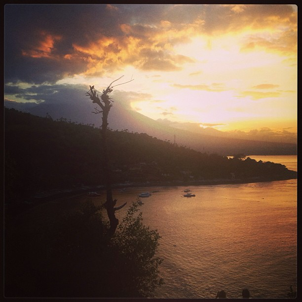

Greetings to listeners. I’m in the last leg of my long journey across Myanmar, Thailand, and Indonesia. Because of uncertain Internet connections and general lack of time, I haven’t been able to record a new show in a few weeks, but I am here to assure you that I am returning in due form very soon.

I hope to host a few special episodes concentrating on the places I have visited and the insights gained from them, as well as writing a few articles which will appear across different media sources.

For this week, I’ve chosen to replay “An Indian Son Goes Home”, in which I interview my friend Vinay Multini as he goes back to his native India after a 10 year stay in the U.S.

He talks about the differences he sees, the life he’s leading now, and many more interesting tidbits that you can’t hear anywhere else. Enjoy.

[EPISODE INFO](http://http://libertyinexile.com/2013/02/06/an-indian-son-goes-home/)
