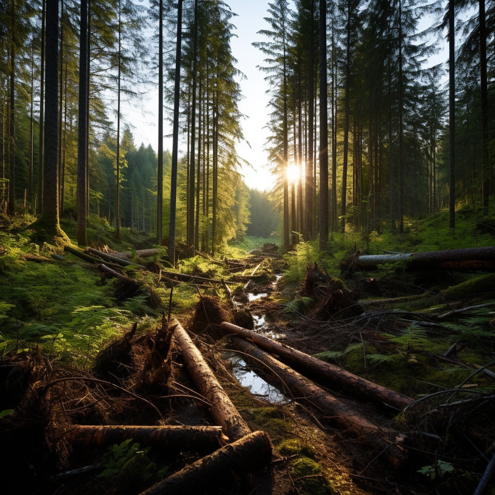

**_The media claims our forests have reached a "tipping point." Science says otherwise._**

Canada is a world leader in sustainable forest management. The deforestation rate hovers [near zero](https://www.nrcan.gc.ca/sites/nrcan/files/forest/sof2022/SoF_Annual2022_EN_access.pdf), wildfires have been in decline for decades (despite the recent tragedies) and the billions of trees dotting our landscape suck large amounts of carbon dioxide out of the atmosphere. These are all points of celebration, but that’s lost on many who claim to champion environmental views.

Barry Saxifrage, visual carbon columnist for _Canada’s National Observe_r’s (CNO), has a much starker view: “[Our forests have reached a tipping point](https://www.nationalobserver.com/2023/08/21/analysis/our-forests-have-reached-tipping-point),” he declared on August 21. Beaming with colorful charts and scientific jargon, his article alleges that because of “decades of surging” logging emissions, “Canada's managed forest is a gigantic carbon bomb.”

This is a stunning visual that calls us to action, but it’s just not true.

Those claims were recirculated for an American audience by _New York Times_ contributor David Wallace-Wells with the [drastic headline](https://www.nytimes.com/2023/09/06/opinion/columnists/forest-fires-climate-change.html), “Forests Are No Longer Our Climate Friends.”

The issue with both articles, apart from their climate doomerism, is that they’re largely based on questionable research published last year by the Natural Resources Defense Council (NRDC)—a US activist group that has routinely criticized Canadian forestry for years.

We [thoroughly debunked](https://www.thespec.com/opinion/contributors/attacks-on-forestry-industry-strain-credulity/article_a114d869-6c05-5d12-b56f-612790f6e287.html) that report in the _Hamilton Spectator_ in response, but the mainstream has decided the claims fit the bill enough to stick.

Saxifrage and Wallace-Wells express valid concerns about climate change and wildfires, which I believe we all share. But their specific claims contradict a broad scientific consensus and leave readers with the false impression that our managed forests have set us on a course to climate armageddon. 

Both articles are shot through with analytical errors, key factual omissions and other distortions that are plainly intended to drive an agenda focused more on politics than climate solutions.

#### **(Mis)counting carbon emissions**

To give a quick breakdown, Canada’s managed forests “both remove carbon from the atmosphere as they grow … and emit it when they die and decay or burn,” [explains Natural Resources Canada](https://d1ied5g1xfgpx8.cloudfront.net/pdfs/40247.pdf) (NRCan).

A variety of human and natural activities affect this balance. Logging emits CO2; replanting trees removes it from the atmosphere. Natural disturbances—forest fires, for instance—emit carbon dioxide, while natural tree regeneration removes carbon. Human activity in managed forests, like slash burning, fire suppression and insect control, also affects the forests’ ability to remove carbon from the atmosphere. This is very well studied by a broad spectrum of academics.

It’s also why the Canadian government takes a holistic approach to measuring emissions from our managed forests and separates those areas from areas subject to natural disturbances. NRCan’s methodologies are based on [extensive peer-reviewed research](https://www.nrcan.gc.ca/climate-change/climate-change-impacts-forests/forest-carbon/estimating-forest-carbon-emissions-and-removals/24179#sciencebasedapproach) and widely endorsed by the scientific community. There is no controversy here.

Rather than focusing on only harvesting or other human disturbances, NRCan scientists carefully monitor and consider all the activities that take place in managed forests to estimate the overall climate impact. Here’s one striking finding from the agency’s most recent [State of Canada’s Forest report](https://www.nrcan.gc.ca/sites/nrcan/files/forest/sof2022/SoF_Annual2022_EN_access.pdf):

In sum, when you follow the internationally recognized methods and consider all emissions _and_ removals from Canada’s managed forests, you find that they remain a significant carbon sink: they remove more CO2 from the atmosphere than they emit. They’re not the “climate bomb,” as dramatically presented elsewhere.

Saxifrage, for his part, objects to this methodology. NRCan scientists “mix critical logging emissions data in with other forest emissions,” he claims. Following NRDC’s lead, he insists that logging industry emissions from recently harvested areas should be counted in isolation from natural activities that remove carbon. Put simply, this idiosyncratic approach exaggerates the total amount of carbon our forests release into the atmosphere, which is precisely why most experts reject it.

Werner Kurz, senior research scientist with the Canadian Forest Service of Natural Resources Canada and IPCC contributor, summed up [the situation last year](https://biv.com/article/2022/10/report-questions-carbon-emissions-forestry):

> What we’re doing is consistent with what the rest of the world is doing. Nobody reports in isolation logging emissions. Everybody reports emissions and removals from forest management.

Again, none of this information is difficult to find and it remains uncontroversial. I highlighted all of it in an [op-ed](https://www.thespec.com/opinion/contributors/attacks-on-forestry-industry-strain-credulity/article_a114d869-6c05-5d12-b56f-612790f6e287.html) and two [extensive](https://twitter.com/YaelOss/status/1613964180955987986) Twitter [threads](https://twitter.com/YaelOss/status/1602349667840397318) responding to NRDC. It’s concerning that reputable journalists working for two major publications overlook these crucial details while presenting their views to the public.

#### **Logging worse than oil sands?**

There was another critical flaw in NRDC’s methodology that these authors failed to identify. The US activist group alleged that net logging emissions rivaled and **may have even exceeded** those from oil sands operations between 2005 and 2018.

Canada’s oil industry, mostly based in the oil sands of Alberta, is a vital industry in our country, but it is baffling that environmentalists have taken this as a solid point.

That conclusion is based on an unjustified assumption about long-lived wood products. When trees are harvested and used in construction, for instance, they store large amounts of CO2 and slowly release it over decades. As _Nature _ [reported in 2020](https://www.nature.com/articles/s41893-019-0462-4), expanding the use of timber in construction keeps more carbon out of the atmosphere because buildings are much less vulnerable to fire than trees. Wider use of wood products also reduces demand for cement, which still emits “stubbornly high” levels of CO2, according to the [International Energy Agency](https://www.iea.org/energy-system/industry/cement) (IEA). It’s yet another [virtue](https://www.sciencedirect.com/science/article/abs/pii/S0959652609002054) of typical North American home-building that relies on lumber.

NRDC’s estimate of net logging emissions accounted for none of these qualifications and started “with the amount of emissions that would occur if all the carbon extracted by logging **in the given year** went immediately into the atmosphere.” \[emphasis mine\]

In other words, NRDC’s calculations were based on the unrealistic assumption that all carbon from harvested wood products would be emitted as CO2 in the same year as logging took place—something that never happens, and no serious scientist would dare to claim it.

While it’s true that _some_ carbon from harvested wood will return to the atmosphere, most of it remains contained in forest products for years. But NRDC used this methodological shortcut to overinflate the estimates for logging emissions in an effort to place the blame squarely on industry and those of us who rely on forest products for our own needs. Even still, NRDC’s own estimates showed a decline in logging emissions since 2005.

When we employ NRCan’s science-based methodology and include data from previous decades—which NRDC arbitrarily excluded from its graph—we can see that CO2 emissions from our managed forests are essentially zero. One would think this would automatically discount these arguments.

Source: [NRCan](https://natural-resources.canada.ca/sites/nrcan/files/forest/sof2022/SoF_Annual2022_EN_access.pdf).

#### **Suppressing Science**

Saxifrage argues that “\[t\]his year's coast-to-coast wildfires” and “business-as-usual logging” are equally troubling sources of forest emissions. But he is mistaken for two important reasons. First, most forest disturbance is driven by fire, insects and disease; these three variables damage about five percent of total forest area annually—roughly 25 times the area we sustainably harvest.

Second, unmanaged forests tend to gradually lose their CO2-absorbing benefits as older, dying trees [release stored carbon](https://files.ontario.ca/mnrf-17-313-climate-change-2021-01-26.pdf) into the atmosphere. Responsible forest management, including carefully planned harvesting and replanting, helps to mitigate this risk. That’s precisely why the United Nations says a responsible forest management [strategy](https://www.ipcc.ch/site/assets/uploads/2018/02/ar4-wg3-chapter9-1.pdf) “will generate the largest sustained mitigation benefit.” 

It’s why I’ve [written so feverishly](https://www.ocregister.com/2023/09/07/environmentalist-conceit-on-basic-forest-management-will-bring-more-devastation/) about how dangerous our forests become when we neglect prescribed burns and general forest management — whether in Hawaii, California or western Canada.

A more general point worth considering is that forest fires in [Canada](https://www.fraserinstitute.org/sites/default/files/trends-in-canadian-forest-fires-1959-2019-exsum.pdf) and [around the world](https://royalsociety.org/blog/2020/10/global-trends-wildfire/) (and thus the CO2 they emit) have been declining for decades. The public doesn’t know that because “the media tend to report on the costly and sometimes tragic impacts of some wildfires,” a [2016 analysis](https://royalsocietypublishing.org/doi/10.1098/rstb.2015.0345) noted, without explaining the broader trend. 

This is highlighted in the recent controversy surrounding climate researcher Patrick Brown, who took to _[The Free Press](https://www.thefp.com/p/i-overhyped-climate-change-to-get-published)_ to explain why his recent paper in _Nature_ on wildfires and climate change was severely edited to fit the editorial line despite the lack of hard evidence. Science is a messy process that develops over time with evidence and must be replicable, and [he felt](https://www.washingtonpost.com/climate-environment/2023/09/11/patrick-brown-climate-wildfires-breakthrough/) that standard was lost in the pursuit of a larger goal.

#### **Canada’s sustainability track record**

Relying heavily on the _National Observer_ piece, the _Times’_ Wallace-Wells also challenged Canada’s record on sustainable forestry. He even [mocked our country for posing](https://www.nytimes.com/2023/09/06/opinion/columnists/forest-fires-climate-change.html) “as a soft-spoken environmentalist leader” while “its overall carbon production has actually grown since 1990.”

This claim about our growing emissions is deeply misleading. If we include all the available data, Canada’s share of annual global CO2 emissions has been declining since the 1940s. In 2021, it had fallen to 1.5 percent, according to [Our World in Data](https://ourworldindata.org/annual-co2-emissions):

Though we can debate why that decline has happened — whether it’s more innovative, sustainable practices or rising emissions elsewhere — the fact remains that Canada, as a large steward of vast natural resources, is a sustainability leader. 

When it comes to protecting our forests, independent experts [have endorsed](https://www.sciencedirect.com/science/article/abs/pii/S1389934119304964) our management practices and regulations. “Canada has comprehensive policies and a legislative framework in place at the national, provincial and local levels,” the authors of [a 2020 study](https://www.sciencedirect.com/science/article/abs/pii/S1389934119304964) concluded. By comparison, most other jurisdictions “have only national and state level policies and a legislative framework to support sustainable forest management.”

This positive trend can be seen across many industries charged with managing Canada’s abundant natural resources. As Ontario native and risk expert Dr. David Zaruk [recently explained:](https://www.thefirebreak.org/p/sustainability-wars-us-ngos-attack)

> While Canada remains a major forestry product exporter, its forest cover has been stable for the last three decades. Swimmers are back in Lake Ontario and fisheries are recovering. Mineral, oil and gas production and transportation are more sustainable. Resources are being managed responsibly.

Indeed, US activist groups have targeted Canadian industry precisely _because it is_ environmentally friendly. We’ve shown the world that it’s possible to improve economic living standards and protect our natural resources. This presents a problem for groups like NRDC and their allies in the press, who see economic growth itself as an ecological threat. Even as the environment gets cleaner, [these activists](https://www.wired.com/story/opinion-why-degrowth-is-the-worst-idea-on-the-planet/) “have trouble taking yes for an answer,” as Wired contributor Andrew Mcafee observed in 2020.

#### **Climate activists critique Wallace-Wells reporting**

It’s disappointing that Wallace-Wells didn’t consider this information before attacking Canada’s sustainability track record. But it isn’t surprising. His mishandling of climate data has actually led some of his ideological allies to repudiate his journalism. For example, eminent climatologist Michael Mann argued that Wallace-Wells’ 2017 _New York Magazine_ essay “The Uninhabitable Earth” [amplified](https://www.facebook.com/MichaelMannScientist/posts/1470539096335621) “a paralyzing narrative of doom and hopelessness.” Doomerism on display.

Publications as diverse as _[The Atlantic](https://www.theatlantic.com/science/archive/2017/07/is-the-earth-really-that-doomed/533112/), [Grist](https://grist.org/climate-energy/stop-scaring-people-about-climate-change-it-doesnt-work/)_ and even _[The Guardian](https://www.theguardian.com/environment/2021/feb/27/climatologist-michael-e-mann-doomism-climate-crisis-interview)_ joined Mann in critiquing the story. Climate journalist Eric Holthaus [documented](https://twitter.com/EricHolthaus/status/884865904168906753?ref_src=twsrc%5Etfw%7Ctwcamp%5Etweetembed%7Ctwterm%5E884865904168906753%7Ctwgr%5Eb73f5386d1fb9124dfe8cde0fa90c44291d14ad6%7Ctwcon%5Es1_&ref_url=http%3A%2F%2Fcpsfilelocker.com%2Ftwitter%2F2023%2F09%2F12%2Fdavid-wallace-wells-recon%2F) “14 factual errors or exaggerations” in the NYMag article. From melting permafrost to accelerating temperatures and declining topsoil quality, Wallace-Wells badly misrepresented the evidence he cited. Even the title, “Uninhabitable Earth” was a “misread of the original research,” [Holthaus observed](https://twitter.com/EricHolthaus/status/884869832692441088).

#### **Journalists spiking journalism**

The real question is: why would our national media join American news outlets and activist groups in attacking Canadian industry? Well, it’s a question of incentives. _The National Observer_, for example, has [taken money](https://www.nationalobserver.com/node/32198) from more than a dozen wealthy foundations in recent years to produce alarming climate stories. The outlet’s Climate Solutions Reporting Project [says it all](https://www.nationalobserver.com/node/32198):

> Species at risk. Oceans in peril. Poisons on the land and in the water. Unprecedented megafires. Millions of refugees in a life-and-death struggle to survive. At a time when the Earth faces such overwhelming challenges, the stories we tell have never been more important.

In particular, the news outlet has taken many thousands of dollars from the [Tides](https://web.archive.org/web/20171007154848/https:/tidescanada.org/2016-year-in-review/great-bear/), [IVEY](https://www.nationalobserver.com/node/32198) and [Echo](https://fondationecho.ca/en/environment/) foundations; all three philanthropies support NGOs like Stand.Earth and Nature Canada, which run big-budget anti-forestry and degrowth campaigns alongside NRDC. 

And this isn’t even mentioning the [hundreds of millions of dollars](https://nationalpost.com/news/politics/600m-in-federal-funding-for-media-a-turning-point-in-the-plight-of-newspapers-in-canada) in subsidies the Trudeau government has thrown at media organizations around the country, raising worthwhile ethical concerns that continue to [shape debate](https://www.canada.ca/en/canadian-heritage/news/2022/10/additional-support-to-strengthen-local-and-diverse-journalism.html) in Canada.

The _National Observer_ [bills itself](https://www.nationalobserver.com/about) as a digital warrior in the battle against “online misinformation,” a source of investigative journalism that “strives to meet a high standard of ethics and … evidence-based reporting.” The _Times_ likewise [boasts that](https://www.nytimes.com/editorial-standards/ethical-journalism.html#introductionAndPurpose) its staff “have jealously guarded the paper’s integrity” for “more than a century.”

It’s difficult to harmonize those statements with the inaccurate journalism these outlets have produced with the issues we’ve highlighted. So what’s really going on here? Like many others in the news business, CNO and the _Times_ are financially dependent upon or ideologically sympathetic to the subjects of their reporting, encouraging them to slant their coverage to the point of inaccuracy.

Both [Canadians](https://www.cbc.ca/news/editorsblog/editor-blog-trust-1.5936535) and [Americans](https://knightfoundation.org/reports/american-views-2023-part-2/) are rapidly losing trust in their respective media establishments as a result. We can only hope that journalists start reporting all the facts — even the inconvenient ones — before their audiences abandon them for [better sources](https://www.acsh.org/news/2023/08/30/pay-play-journalism-killing-media-good-riddance-17303) of information.

_Originally published on [The Firebreak](https://www.thefirebreak.org/p/us-green-activism-bad-journalism)._
