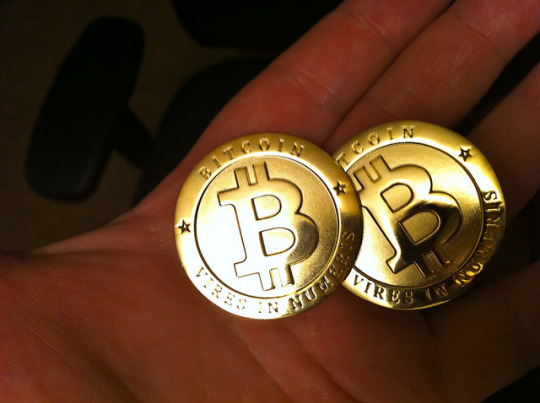

I was [quoted in a Vice article](https://news.vice.com/story/as-bitcoin-hits-10000-young-investors-are-eager-to-reap-the-benefits) on the latest Bitcoin milestone.

> You could speed up a transaction, but that would cost you an extra fee — at times, 10 percent of the amount you’re trying to transfer, which, given today’s prices, simply don’t make sense for the average retail investor.
> 
> “I bought a coffee at a London cafe for 3 pounds, and I had to wait 2 hours to get it confirmed, and that was back in 2014 when there were fewer transactions” Yael Ossowski, a bitcoin investor and Deputy Director at the Consumer Choice Center, an international think-tank, told VICE Money.
> 
> Ossowski calls cryptocurrencies an “experiment,” and the bitcoin bubble “investor craziness”.
> 
> “The 21st-century version has welcomed a plethora of slick consultants, hazy schemes dressed up as investor possibilities, and too much wishy-washy language for anything to really make sense to anyone who wants to use a digital currency to make purchases,” he argued in a [scathing Huffington Post op-ed](http://www.huffingtonpost.ca/yael-ossowski/bitcoin-has-become-about-the-payday-not-its-potential_a_23209539/).
