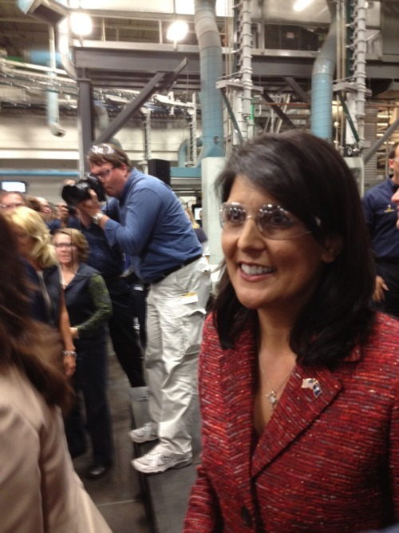

By Yaël Ossowski | Wisconsin Reporter

> SUSSEX — Among the humming of printing presses and beeps of forklifts in the distance, Gov.**Scott Walker** addressed a crowd of factory workers at the **Quad Graphics** plant here Friday afternoon, playing to a group eager to hear his message on job creation and fiscal restraint.
> 
> They have lived in the real economy.
> 
> “What we’ve really got is a guy who’s looking to change the system, put everything back on track,” exclaimed a Quad Graphics employee with the name Dan sewn on his shirt, standing within earshot of at least 10 workers who nodded along. Dan wouldn’t give his last name.
> 
> “They’re all getting angry and upset, those other folks — but Walker has only been in office a year and we’ve got so much positive change,” said Dan.

Read more: [Wisconsin Reporter](http://www.wisconsinreporter.com/walker-with-scs-haley-builds-on-message-at-sussex-factory)
