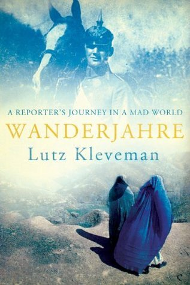

There’s nothing more satisfying than the thoughtful ravings of a wily foreign correspondent who returns home. Especially once it can be melted down into a kind of beautiful soliloquy on the mad state of affairs in the world.

That’s what I picked up in Lutz Kleveman’s [_Wanderjahre: A Reporter’s Journey in a Mad World_](http://www.amazon.com/Wanderjahre-Reporters-Journey-Mad-World/dp/1495387798), a fitting narrative that is as much a personal and spiritual journey as a historical account of various hot-spots around the world and the malaise that condemns them.

Kleveman, a German journalist and _jack-of-all-trades_ who peppers his speech with enough English and French idioms to be considered a good European, shines throughout this book. He made his career dispatching reports from the unforgivable pits of deserts and jungles for the Telegraph, Die Zeit, Newsweek, and Playboy Magazine, among others.  

This book, however, represents a marked difference from his first written work, _[The New Great Game: Blood and Oil in Central Asia](http://www.newgreatgame.com/author.htm).  
_

I found that book in search of an answer about the Global War on Terror. Specifically about the simultaneous quest for resources and Middle East domination by the United States in the 21st century, seemingly egged on by a kind of Islamic fanaticism we couldn’t understand in the West. Kleveman frames the battle of the new century as a “New Great Game,”  a rehashing of the European obsession with controlling the resources of Central Asia and the Middle East throughout the 19th and 20th centuries. Now, the torch has passed to the Americans.  

It’s a fascinating thesis backed up by vivid and sometimes hilarious first-hand reporting – a task seemingly impossible for the millions of armchair policy analysts who have made similar claims.

And while that book may have aimed to present an argument for why the West is so adamant about controlling largely undesirable portions of the world, it also weaves a tale of a reporter who began questioning his connection to the world around him. A world so strife with violence, disease, and war that he could only witness and record for millions of others.  

“As interesting as the grandstand seat may have been, I am now sick and tired of just being an observer,” he later writes in _Wanderjahre_.  

For his next book, readers are fed the insight of the man behind the words and amusing stories. It’s crafted together as easily as a news article. He’s on quest for understanding his family history, for a good smoke of opium, and for a taste of the bitter human experience in geographical destinations others can rarely manifest on a piece of paper.  

The journey to understand his own genetic disposition stems from his family’s long history with the military and war. By use of the meticulous notes and letters passed down through the years, we read the words of his grandfather, a Prussian solider held as a POW in Siberia during the First World War. We’re invited into the world of the warring factions of his family, uncles, wives, and brothers alike, emboldened by the experience of war but also scarred deeply by it.

“Perhaps I was more influenced by my officer grandfather than I would have liked to admit? Was it conceivable that, though I never served in the army, I had inherited a genetic affinity to wars?” he writes.  

Though the bullets aren’t flying and trenches are no longer dug in his native Germany, there is still a war in his mind. It’s derived from the reflection with on the life he’s chosen as a daredevil reporter in battlegrounds across the Earth, from Afghanistan and Iraq, Brazil and Colombia. His goal was to sell his stories and tell the truth about them.  

“To sell my stuff I had to go to places where newsworthy things were happening. However, the more complex and more adult truth is that I was fascinated by conflict and war. I loved the heroic, the large-scale drama. Only in war zones, I thought, would I be able to observe great history in the making,” writes Kleveman.  

The most interesting stories he tells are unique blends. They’re effortlessly threaded between the historical narratives of his family and galloping stretches into the very warped countries and cultures which are now embedded in our TV-obsessed minds.

As a journalist myself, albeit nowhere near the scale of Kleveman’s adventures, how he creates his own character through his writing is what is so endearing.  

Rather than playing the role of the casual correspondent who must remain objective, Kleveman unloads at the backward customs of the Taliban authority in Afghanistan or the depressing use of child soldiers and slaves in Sierra Leone for the diamond hunt.  

Of course, as he delves into his German family history, I cannot help but be intrigued. Much like Kleveman, my own family narrative is also indeterminably tied to the experience of war. It’s personified through my grandfather, a former Germany army recruit and later refugee from East Prussia to Canada after the Second World War.  

The life-shattering experience of seeing your homeland ripped from its roots is enough to jettison your staunch worldview at every turn. Especially once you convince yourself of the barbarity of armed conflict. That’s what we can see from every chapter of the story.  

What makes Kleveman’s latest book all the more interesting is that it’s written as an eulogy to the mind and craft of a curious man. We learn of the deal he’s made with his mother, to explore the world for a few years with the promise of returning home to northern Germany to run the family estate.  

Though he rejects this fate throughout his life, he is naturally drawn to accepting and relishing it. True to form, it’s where he sits today.

And there’s a lesson to be found from that.  

Despite the years of travel and adventure as a reporter, there comes a time when one is rubbed to the point of numbness. Everything familiar becomes holy while the unknown loses its luster.  

“That in itself was sad enough, but the main reason was that I had lost the essential qualities of a good reporter: curiosity and empathy,” writes Kleveman.

And though _Wanderjahre_ as a standalone tome cannot live up to the entirety of his career and experience, it’s a worthy shot. It succeeds in painting the worldview of a man lost between the pull of the past and that of fading intrigue of the present. I can think of no other book to suggest to anyone curious about seeing the world through the eyes of someone who made a living describing it to millions.
