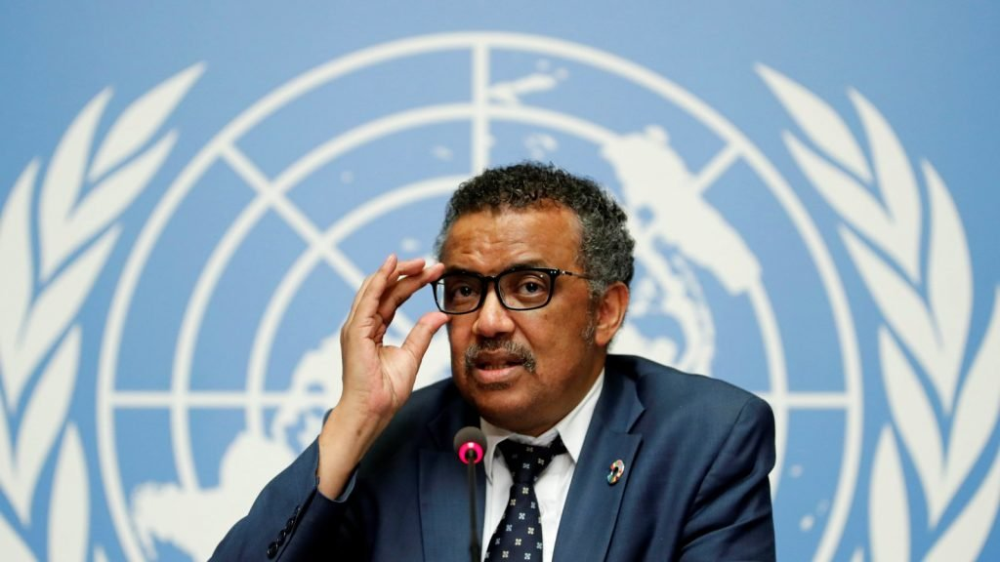

## And weakening of IP rules would actively hurt the most vulnerable.

A full 14 months into the pandemic, [nearly half](https://www.bloomberg.com/graphics/covid-vaccine-tracker-global-distribution/) of Americans who are eligible have received at least one vaccine dose. The end is in sight, and we have innovation to thank. And so, as our economy reopens and restrictions are being lifted, attention is turning to hard-hit nations like India and Brazil, [currently](https://www.msn.com/en-us/news/world/indias-covid-crisis-countries-pledge-aid-and-resources-as-hospitals-run-out-of-oxygen/ar-BB1g3oOd) experiencing skyrocketing case numbers. 

The question, then, is how to boost vaccinations abroad. The _New York Times_ notes that India’s outbreak is causing the country to [restrict export of its own vaccines](https://www.nytimes.com/live/2021/04/24/world/covid-vaccine-coronavirus-cases?type=styln-live-updates&label=coronavirus%20updates&index=0&action=click&module=Spotlight&pgtype=Homepage#the-us-is-under-pressure-to-release-vaccine-supplies-amid-indias-deadly-virus-surges-deadly-virus-surge), which could hurt Africa in particular, since those nations are relying on Indian vaccines. 

In the face of [pressure](https://www.nytimes.com/live/2021/04/24/world/covid-vaccine-coronavirus-cases?type=styln-live-updates&label=coronavirus%20updates&index=0&action=click&module=Spotlight&pgtype=Homepage#the-us-is-under-pressure-to-release-vaccine-supplies-amid-indias-deadly-virus-surges-deadly-virus-surge) to use every tool available to boost vaccinations abroad, the Biden administration announced last week that it supported a proposal to waive patent protections on the COVID vaccines. 

https://twitter.com/AmbassadorTai/status/1390021205974003720

This measure, which is called a TRIPS Waiver (Trade-Related Aspects of Intellectual Property Rights) and was put forth [last fall](https://www.wto.org/english/news_e/news21_e/trip_11mar21_e.htm) at the World Trade Organization by India and South Africa, would be far more than just a temporary fix for more shots.

If the waiver is triggered, it would ostensibly nullify IP protections on COVID vaccines, allowing countries and companies to copy the formulas developed by private vaccine firms in hopes of making their own, with no guarantee of success or safety.

The coalition backing Biden’s pledge [includes](https://msfaccess.org/wto-covid-19-trips-waiver-proposal-myths-realities-and-opportunity-governments-protect-access) Doctors Without Borders, [Human Rights Watch](https://www.hrw.org/news/2021/03/11/rights-key-tackle-corruption-inequity-vaccine-access), and World Health Organization Secretary-General Tedros Adhanom Ghebreyesus, who [first](https://www.thehindubusinessline.com/economy/who-lends-support-to-ip-waiver-proposal-from-south-africa-india/article32885984.ece) backed this effort in 2020 before any coronavirus vaccine was approved.

Intellectual property rights are protections that help foster innovation and provide legal certainty to innovators so that they can profit from and fund their efforts. A weakening of IP rules would actively hurt the most vulnerable—the same people that groups who support the IP waiver are nominally trying to help.

The power to issue the waiver comes from a section in the 1995 treaty that created the World Trade Organization, meant to protect intellectual property among global trade partners. While a COVID vaccine waiver would be the most substantial one to date, [similar](https://papers.ssrn.com/sol3/papers.cfm?abstract_id=2088705) efforts have been attempted on both HIV/AIDS medicines and generic drugs, the latter the only other successful case.

The push for a waiver ignores that many companies have voluntarily pledged to sell their vaccines at cost or even offered to share information with other firms. Moderna, for its part, has [stated](https://investors.modernatx.com/news-releases/news-release-details/statement-moderna-intellectual-property-matters-during-covid-19) it will not enforce the IP rights on its mRNA vaccine during the pandemic and will hand over any research to those who can scale up production. The developers of the Oxford-AstraZeneca vaccine have pledged to [sell it at cost](https://www.theguardian.com/business/2021/mar/28/astrazeneca-vaccine-deserves-celebration-not-scorn) until the pandemic is over.

Further, this measure would have far-reaching implications. Supporters claim that because COVID represents such a global threat and because Western governments have poured billions in to securing and helping produce vaccines, low and middle-income countries should be relieved of the burden of purchasing them. But rich countries are already [donating vaccines](https://www.who.int/news/item/15-07-2020-more-than-150-countries-engaged-in-covid-19-vaccine-global-access-facility) to the World Health Organization**’**s COVAX program, which gifts countries vaccines free of charge.

There are a few reasons that a TRIPS waiver is unlikely to be the most efficient solution. The vaccines require specialized knowledge to develop and produce these vaccines, and the mRNA vaccines require cold storage. As economist Alex Tabarrok has [pointed out](https://marginalrevolution.com/marginalrevolution/2021/05/ip-is-not-the-constraint.html), vaccine makers have been scouring the globe for adequate vaccine facilities but fallen short. 

It  seems implausible that any of this could be achieved outside the traditional procurement contracts we’ve seen in the European Union and the U.S. What is more likely is an increase of botched and unsafe vaccines that would be risky for vulnerable populations, as philanthropist Bill Gates has [claimed](https://observer.com/2021/04/bill-gates-oppose-lifting-covid-vaccine-patent-interview/) in his opposition to the waiver.

If the cost of researching and producing a COVID vaccine is truly [$1 billion](https://www.managedhealthcareexecutive.com/view/the-price-tags-on-the-covid-19-vaccines) as is claimed, with no guarantee of success, there are relatively few biotechnology or pharmaceutical companies that can stomach that cost. And distribution would be an entirely different story.

If Biden’s administration wants to help vulnerable nations, there is an easier way: release the tens of millions of doses of AstraZeneca vaccines [sitting](https://www.nytimes.com/2021/03/11/us/politics/coronavirus-astrazeneca-united-states.html) dormant in warehouses, which the FDA has not yet approved, and begin exporting our vaccine surplus to the most hard-hit countries. That’s precisely why the [COVAX](https://www.weforum.org/agenda/2020/09/what-is-covax/) initiative was created, and why the U.S. should support it.

Meanwhile, let’s also look at the future implications of moving now to restrict IP protections for the very companies that have delivered the life-saving vaccines that will get us out of our current pandemic.

BioNTech, the German company headed by the husband-wife team of Uğur Şahin and Özlem Türeci that partnered with Pfizer for trials and distribution of their mRNA vaccine, was originally founded to use mRNA to cure cancer. Before the pandemic, they took on [massive debt](https://simplywall.st/stocks/us/pharmaceuticals-biotech/nasdaq-bntx/biontech/news/is-biontech-nasdaqbntx-weighed-on-by-its-debt-load) and scrambled to fund their research. Once the pandemic began, they pivoted their operations and produced one of the first mRNA COVID vaccines, which hundreds of millions of people have received.

With billions in sales to governments and millions in direct private investment, we can expect the now-flourishing BioNTech to be at the forefront of mRNA cancer research, which could give us a cure. The same is true of many orphan and rare diseases that do not otherwise receive major funding.

Would this have been possible without intellectual property protections?

If we want to be able to confront and end this pandemic, we will continue to need innovation from both the vaccine makers and producers who make this possible. Granting a one-time waiver will create a precedent of nullifying IP rights for a host of other medicines, which would greatly endanger future innovation and millions of potential patients.

Especially in the face of morphing COVID variants, we need all incentives on the table to protect us against the next phase of the virus. 

Rather than seeking to tear down those who have delivered the miracle of quick, cheap, and effective vaccines, we need to support their innovations and provide supplies to countries who need them. Symbolic gestures that will have drastic consequences, especially on the most vulnerable, just aren’t up to the task.

_Yaël Ossowski ([@YaelOss](https://twitter.com/YaelOss)) is deputy director of the Consumer Choice Center, a global consumer advocacy group._

_Published in [The Dispatch](https://thedispatch.com/p/we-dont-need-to-lift-patents-to-make)._
