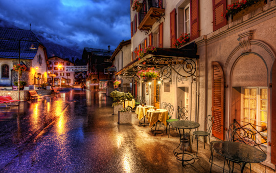

By Yaël Ossowski | [Devolution Review](https://devolutionreview.com/what-of-our-grand-experiment/)  

**The fate of Europe seems forever in flux. We need to rethink its foundations.**

Unbeknownst to millions of ordinary European citizens, they’ve participated in a grand experiment for the past two decades. It’s the modern version of an imperial territorial zone, customs union, and free travel zone—all rolled into one. For its size and scale, it’s truly unprecedented in history.

The ‘permission slips’ for conducting this grand experiment were tacitly distributed among nation-states and exchanged between government bureaus. Wherever the public got too curious, a vote was reluctantly held—a general plebiscite—which avoided the complexity of technical jargon, the default lingua franca of bureaucracies.

At these plebiscites, some countries said ‘no’ to the Euro, the common European currency, or voted down the chance of joining the European Community, the precursor to the European Union. Some even outright rejected various European treaties. But inevitably, these voices were ignored.

So even though this grand experiment faced some roadblocks in the form of sporadic democratic resistance, it has generally coasted along without interruption, free to morph into the utopian design of its most ardent supporters (mostly liberal internationalists with no regard for national boundaries).

That is why the British rebuke of the European project, voiced through the popular referendum to withdraw the United Kingdom from the European Union in June 2016, was so significant. It was not expected by European elites. It is only the latest sign that the ‘lab subjects’ of the experiment are finally beginning to revolt against their white-coated political scientists.

And although it was denied by European leaders, it does seem that the refugee crisis of the past few years has taken a larger toll on the European project than its current defenders are willing to admit. The fallout from this crisis has put the very philosophy of European integration into doubt—assuming it was ever really known in the first place.

**A Union without a Cause**

The architects of European Union have thus far characterized the economic and political union as a guarantor of peace in Europe; a palliative institution to protect against nationalism and intolerance in nation-states; the guiding hand of prosperity in the continent.

Such was certainly the universalist wish of Austrian writer and poet Stefan Zweig, an unabashed ‘cultural European’ who saw the folly of nationalism and border controls as an impediment to the true nature of a transcultural European people.

“How pointless, we said to ourselves, frontiers were if it was child’s play for any aircraft to cross them, how provincial and artificial were customs barriers and border guards, how contrary to the spirit of our times that clearly wished for closer links and international fraternity,” he wrote in his autobiography The World of Yesterday, published in 1942.

It doesn’t take much imagination to see Zweig’s most romantic ideal upheld in the current experiment that is the European Union. But much like in Zweig’s time, world events have a habit of extirping such grand visions of cosmopolitanism.

For Zweig, who was Jewish, it was the spectre of a Nazi Europe and a World War that dashed his hopes. Today, it’s the external pressures of the refugee crisis, the question of multiculturalism, and growing scepticism of supranational and national institutions as effective vehicles of progress.

As such, the national borders which began to fade between European powers for the last two decades have suddenly been invoked and strengthened—much like the harsh rhetoric of the political forces who now demand something be done.

In Austria in 2016, a bungled vote and a growing right-wing base nearly pushed the country to have its first ever president from the Freiheitliche Partei Österreichs (Freedom Party of Austria or FPÖ), Norbert Hofer. In France, Marine Le Pen rode a populist wave which placed her in the second round for the presidential election in May 2017.

What such political movements impart unto voters, unlike their political rivals, are concrete answers to recent crises. There’s a refugee crisis at Europe’s door? Then close the borders and strengthen the state. A rise of an Islamic population within our borders? Then invoke traditional values and Christian morality. Slow growth and disappearing jobs? Impose tariffs and boost welfare to support the native population.

In response, the liberal internationalists—who never allow themselves to be forgotten—bemoan the rise of such populism and nationalism. But much of it is their fault—for they have completely failed to articulate the philosophical foundations of what they were advocating in the first place.

In whose interest is the free movement of Europeans? And who benefits from the erosion of internal borders? So far, such developments seem crafted solely in the interest of industry and governmental institutions. Without a competing personal narrative, how can the current experiment survive?

**The Fate of Our Borders**

The seventeen million voters in the United Kingdom who rejected the modern experiment of the European Union did so for a myriad of reasons. They were, nonetheless, united in their distaste for the direction of Europe—and the liberal internationalists should take note.

The United Kingdom originally opted out of the Schengen Area, but it was still forced to embrace freedom of movement for European citizens. Any visitor to the English capital of London today is confronted with dozens of nationalities in all kinds of jobs, a testament to the great opportunities afforded to those who took advantage of the freedom of movement.

By any measure, freedom of movement has proven to be overwhelmingly positive across Europe, not only in the white papers, statistics, and economic journals of high opinion. But the case was not made clearly nor convincingly to the working-class communities of Europe, all of whom have anecdotal evidence to the contrary. And that’s a real threat.

Given the chance throughout the course of the referendum campaign to make a cosmopolitan argument for the positive effects of immigration and the free movement of peoples, the ‘Remain’ side in the UK resorted to scare tactics. They spoke of isolation and financial collapse. They predicted doom and convinced already skeptical populations to reject the status quo.

The question of whether a country can limit the people who migrate to its shores has long been pressing and should not have been ignored. But it became even more urgent with the refugee crisis, in which millions of people risked everything to make their way to the European continent.

In Danubian Europe, the refugee crisis actively unbalanced politics and society. The Conservative Austrian Foreign Minister, Sebastian Kurz—a young, fresh face with a penchant for bluntness—won praise for endorsing the closing of the Balkan Route to prevent fresh numbers of refugees. Due to pressure from the FPÖ and an uneasy electorate, former Chancellor Werner Faymann of the Social Democrats, did the same. He resigned in May 2016 and ceded power to Christian Kern, the former head of the state-owned Austrian railway.

Understanding why this matters is important for determining the fate of the European experiment and the borders both inside and outside the continent.

The reason for accepting refugees in such great numbers, said German authorities, was to save them from misery—the misery caused by both the ruthless Assad regime in Syria and the ensuing Western-led intervention which has practically obliterated the area. Such events necessitated ‘fast-tracking’ the migration of hundreds of thousands of non-Europeans.

German Chancellor Angela Merkel took the lead in inviting those who faced misery back home to make their way to the so-called welcoming arms of Western Europe. An outpouring of sympathy in the humanitarian sphere of the liberal international order was then soon interpreted as a willingness to include all people facing destitute situations—whether Syrian, Egyptian, or Ethiopian, and whether imposed by bombs or dictatorships alike.

A situation of ‘moral hazard’ thus arose. As long as refugees risked life and limb in rubber boats or by trekking across treacherous territory, they would be rewarded with residency, monthly stipends, and special privileges in the First World. This was similar to the offer extended to Cubans who successfully make it to American shores in dinghy boats until just recently.

Naturally, the numbers of refugees from all sorts of developing countries exploded and European institutions quickly found they were unable to cope. At the same time, domestic populations grew restless and began turning to politicians with the answers to solve the problem. In the process, what suffered the greatest loss was the very idea that freedom of movement was a desirable and achievable goal.

The growing resistance to the migration flows has since halted the liberal international dream crafted by the ardent supporters of the European Union—and put it into free fall. Brexit only exacerbates the situation further.

**The Way Forward**

Regardless of the shifting of the winds, none of this need spell the end of liberal cosmopolitanism nor the end of a common project which unites the countries of the European continent. It should be remembered that the nation-states of Europe are rather recent inventions. Multi-confessional, multi-ethnic, and multi-lingual empires were the norm throughout much of the 19th century. Tolerance was a necessary virtue. There is no reason that this, too, cannot continue to be a virtue today.

The principles ingrained therein can still survive; but there must be a philosophical justification applied universally. That’s the only certain way to maintain diversity of culture and institutions, all while contributing to a common project.

Pressed on the tolerance of Roman Catholics in the city of Frankfurt in June 1740 during the first month of his reign, Prussian King Friedrich II (later known as ‘the Great’) earnestly responded:  “All religions are just as good as each other, as long as the people who practice them are honest, and even if Turks and heathens came and wanted to populate this country, then we would build mosques and temples for them,” he said.

In today’s Europe, the failure of modern states to provide a true philosophical case for their rule and their continued existence in the face of adversity puts their legitimacy at risk. This is seen in the emergence of the refugee crisis but also in the crisis of European democracy itself.

When supranational institutions—such as the International Monetary Fund, the European Commission, or the European Central Bank—demand the dismissal of elected leaders and hold domestic populations hostage for the sake of the creditors (as was seen in the cases of Italy and Greece), it creates a new challenge. If such organizations call the shots, what use is the idea of national sovereignty or the democratic will? What agency can a populace truly exercise if their very will is thwarted or ignored by design?

It’s this exact spirit that drove British voters to undertake the most unprecedented referendum of the last decade. It’s the message articulated by anti-establishment political leaders across Europe who seem to have a far better understanding of the present discontent than the current political class.

In his time, Zweig called for a “moral disintoxication of Europe” – that is, getting rid of the forces of extremism in exchange for a new, liberal, international order which all Europeans could collectively benefit from. We are far short of that ideal.

In today’s age, we need to renew his call to detoxify Europe. But we also need to better understand the philosophical framework of our public institutions—and determine how many of them truly benefit the public. Without this, the grand experiment of the European Union will have to be confined to the dustbin of history as nothing more than that: an experiment.
