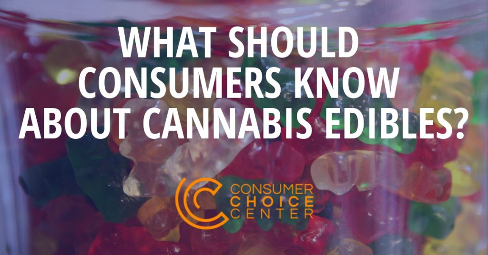
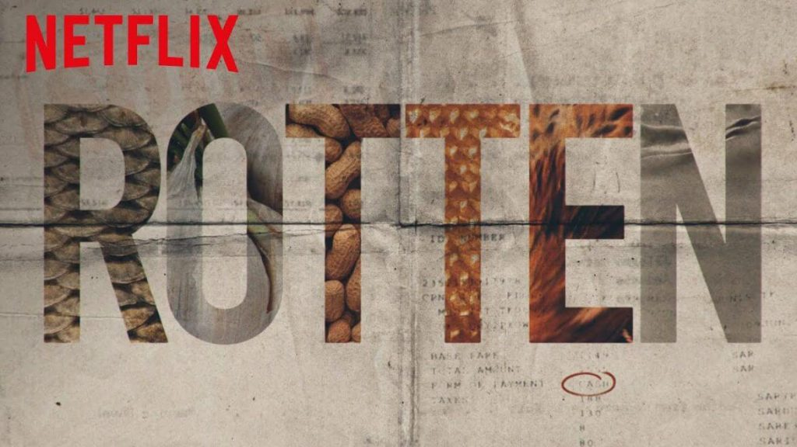

In the second season of the Netflix series _Rotten_, there is an [entire episode](https://www.imdb.com/title/tt11064632/) exploring the world of cannabis edibles. It is highly recommended.

The documentary itself does a great job uncovering the latest innovations, the legal hurdles, and many questions left for consumers who want to try cannabis edibles where they're legal.

Going beyond the documentary, what should consumers know about cannabis edibles?

<figure>

<figcaption>

Check out Rotten Season Two: "[High on Edibles](https://www.netflix.com/watch/80990448)"

</figcaption>

</figure>

First, we should make clear that markets are evolving as quick as the laws are being written.

Cannabis products containing THC, the actual psychoactive compound, remain a Schedule 1 drug per the Controlled Substances Act. This means the federal government believes cannabis (all strains) has a high potential for abuse, has no accepted medical use, and there is a lack of safety even under medical supervision.

However, since 2018's Farm Bill, [industrial hemp has been legal](https://spectator.org/it-was-good-enough-for-george-washington/), opening the door for cannabis strains that contain the non-psychoactive CBD to be sold around the country. I testified on this [important subject](https://www.fda.gov/media/128474/download) at an FDA hearing this spring.

Therefore, though we're mostly discussing THC edibles, there is also a booming market for CBD edibles in stores throughout the United States, the legality of which seems to be supported by the legalization of industrial hemp. It is a gray zone that has not been clarified by any federal law.

Therefore, for THC edibles, they're only technically legal for general consumers in the [eleven U.S. states (including D.C.)](https://disa.com/map-of-marijuana-legality-by-state) that have legalized recreational cannabis.

Though the states differ in regulation, the most mature markets are in California, Oregon, Washington, and Nevada, which have fully functioning legal markets that include edible cannabis products, topicals, and cannabis extracts.

**CANADA**

Canada legalized recreational cannabis in October 2018, but the first phase only included cannabis flowers, to be smoked or cooked into edibles by consumers.

My colleague David Clement has [written](https://consumerchoicecenter.org/ottawas-latest-rules-risk-ruining-cannabis-infused-beverages-before-theyre-even-legal/) about the problematic laws in Canada, which differ by province and will only allow edible products this year.

Though cannabis edibles and extracts will be technically legal by Oct. 17, 2019 (nearly a year after legalization), [Health Canada rules](https://www.canada.ca/en/health-canada/services/drugs-medication/cannabis/resources/regulations-edible-cannabis-extracts-topicals.html) require companies to inform the federal government of their plans starting on that date, at least 60 days before they can sell. So it'll be December before we see any edibles, topicals, and extracts on Canadian shelves.

**EUROPE**

The only jurisdiction that has any legal market in (THC) cannabis is in the Netherlands, but it is far from a commercial market. Because the cultivation and shipment of cannabis are technically illegal, the Dutch system is actually also a gray area, one in which the government tolerates cannabis sales but gives very little legal legitimacy.

That said, many European countries have shops that sell edible CBD products, usually containing less than 0.3% THC in most countries. And several countries such as Germany and Spain do offer [medical cannabis](https://www.globenewswire.com/news-release/2019/02/14/1725264/0/en/Global-Cannabis-Edibles-Market-Will-Reach-Over-USD-11-564-Million-By-2025-Zion-Market-Research.html), including edibles, but only in highly regulated circumstances.

**UNITED STATES**

Returning to the legal THC edible markets for cannabis in the United States, and to the most mature markets mentioned above, legal products in these states have grown in popularity in the years since legislation.

The latest figures from 2017 in Colorado, for example, show that edibles and concentrates now make up [36% of cannabis sales](https://www.colorado.gov/pacific/sites/default/files/MED%202017%20Market%20Study%20Fact%20Sheet.pdf), up from just 30.5% [two years prior](https://earlyinvesting.com/edibles-market-grows-colorado-around-world/).

These edibles range in potency and form, but often are found in gummies, cakes, cookies, lollipops, capsules, chocolates, drinks, and much more. Cannabis "shake" – pre-ground flower – is often sold [to be infused](https://www.leafbuyer.com/blog/why-make-marijuana-edibles-with-shake/) with food at home.

According to the market firm CBD Analytics, gummies are [now the most popular edible item](https://bdsanalytics.com/gummies-are-as-popular-as-ever/) found in cannabis dispensaries. In the first four months of 2019, sales of gummies alone in California, Oregon, and Colorado amounted to more than $115 million.

The states differ in how many milligrams of THC they allow, but following Colorado's rules, each package contains 10mg or 100mg, 10mg being the standard "dose". It is recommended that newcomers [not ingest more than 5mg](https://www.leafly.com/news/cannabis-101/5-tips-to-safely-dose-and-enjoy-cannabis-edibles) during their first try. Too high of a dose will result in a strong effect on the user.

**TESTING**

Testing of edibles is a requirement in these jurisdictions, [mostly for potency, dangerous substances, and pesticides](https://www.moderncanna.com/resources/colorado/), and the results of these tests must be made available to both regulators and consumers. Thus far, most testing is conducted by private labs, which [must be licensed by the states](https://www.sos.state.co.us/CCR/GenerateRulePdf.do?ruleVersionId=7094&fileName=1%20CCR%20212-1).

**TAXATION**

Of course, THC cannabis products are highly taxed in the jurisdictions where they are legal. The average excise tax is 15%, but then one must also add significant sales taxes as well. The Tax Foundation [keeps great documentation](https://www.taxpolicycenter.org/briefing-book/how-do-marijuana-taxes-work) on the competing tax rates on cannabis in states where it is legal.

It is recommended that these jurisdictions keep taxation moderate, lest they push consumers back into the illegal market because of too high prices.

**ADVERTISING AND BRANDING**

Laws on advertising and banding also are quite different between legal jurisdictions for these products. As we have noted in our Policy Primer on [Smart Cannabis Policy](https://consumerchoicecenter.org/policy-primer-on-smart-legalisation-for-cannabis/), Washington State has some of the better laws when it comes to how much information companies can share or how much branding they're allowed to put on the packages for edibles.

More branding and the ability to advertise make it possible for consumers to establish loyalty and root out bad apples. They also give consumers better information on the potency of edibles, the form, tastes, and what the products are best used for. That's crucial for consumer choice.

**WHAT SHOULD CONSUMERS KNOW?**

- Only a handful of U.S. states have legal THC cannabis edible markets
- CBD edibles, thanks to the 2018 Farm Bill, are now widely available around the country
- Cannabis edibles range in potency and form
- Testing of cannabis edibles is highly regulated and must be conducted to check for potency, dangerous substances, and pesticides
- Taxes are generally very high, but should be moderate to encourage the legal market
- Advertising and branding rules sometimes limit what companies are allowed to tell consumers

_Originally published at the [Consumer Choice Center](https://consumerchoicecenter.org/what-should-consumers-know-about-cannabis-edibles/)_
