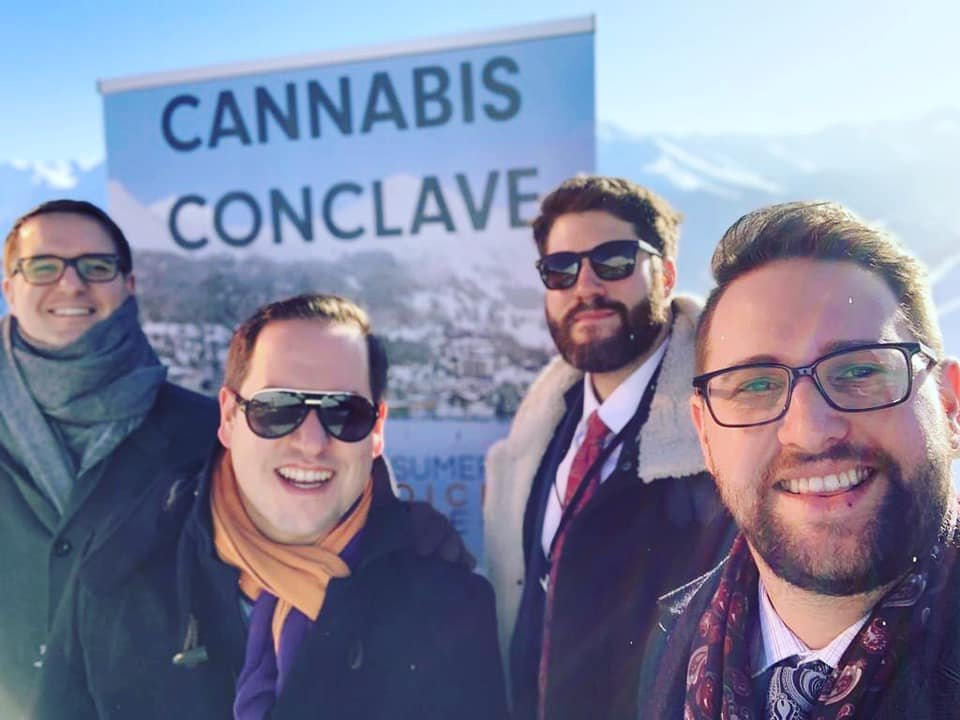
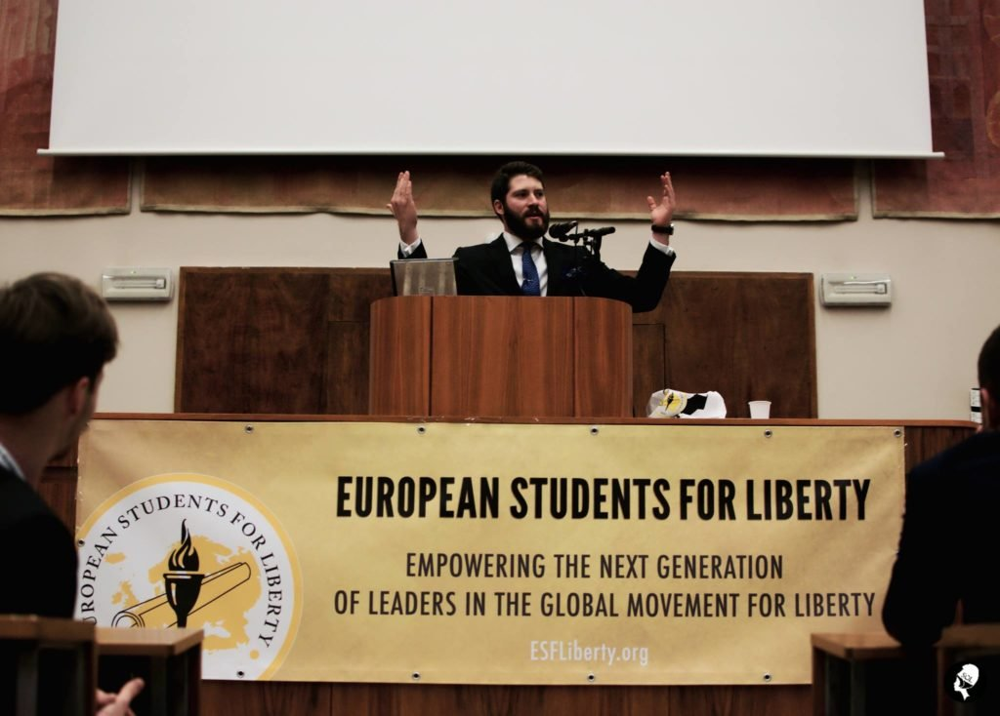
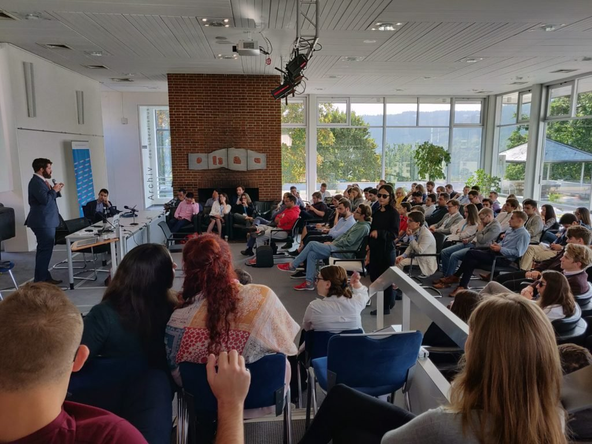
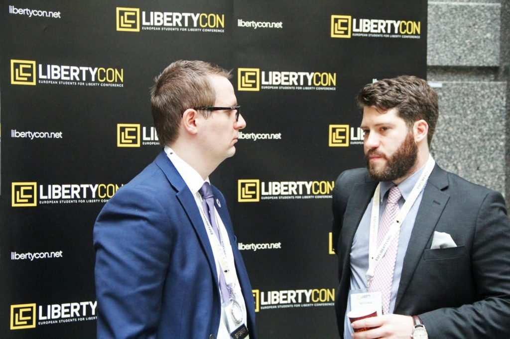

Today marks 6 years for me at [Students For Liberty](http://studentsforliberty.org).

It's difficult to put into words what exactly that means to me.

The organization has been so key to my success and growth as an individual, and has had such an impact on my life, that it's hard to state.

I had been somewhat affiliated with the "classical liberal" movement since the end of high school, mostly on blogs and chat rooms online. And obviously, I became more interested in the ideas with the presidential run of Ron Paul in 2008. I spoke about these ideas weekly on my college radio show "Liberty In Exile" at Concordia University in Montréal and developed someone of a group on campus. But I still had no tribe.

It was in 2011 that I first heard of SFL, working as a journalism intern in Philadelphia. I visited my first regional conference and was immediately inspired by the dozens of other young people who championed the same ideas I did: individual freedom, social tolerance, skepticism of centralized power, and economic prosperity for all.

The next year, after returning from my semester abroad in Vienna, Austria, I met one of the European Students For Liberty co-founders, Wolf von Laer, at an IHS seminar (who is now SFL'S CEO). We kept in touch, and after stints of journalism in North Carolina and Florida, I made the move to Europe in 2013 to be with my then-girlfriend.

It was then that Wolf asked me to apply to join the European Students For Liberty Executive Board. I was ecstatic. I thought I was a shoo-in.

"But don't think you're just automatically in," said Wolf. "We are very selective." Luckily, and despite all my quirks, I passed the interviews and became a volunteer executive board member.

I joined for the first retreat in Switzerland in April of 2013, and I knew already that I had found friends for life. And it all revolved around I caused I believed in: personal and economic liberty.

After a few months, I was asked if I would be willing to become a staff member, to professionalize and lead the operations of the European movement so that it could grow and be as successful as in the U.S.

My day-to-day wasn't work. It was fun and challenging and meaningful beyond belief. It was such a blessing to use my passion every day as the key motivator for my professional life. It was the best fun I've ever had.

I helped organize the next few European-wide conferences (ESFLCs) train volunteer leaders, and travel to dozens of countries to educate, develop, and empower the bright young people who were interested in the ideas of freedom. It was exciting and exhilarating. It gave my life new meaning.

Soon after, I began helping out in different regions and departments. I became senior director, and then senior development officer, organizing large-scale conferences and training programs, fundraising, and overseeing the volunteer activities of hundreds of leaders.

Today, I'm deputy director at a project we founded through SFL, the [Consumer Choice Center](http://consumerchoicecenter.org), where I match my passion for ideas with the actual ability to have them heard and implemented throughout the world.

From the beginning, I've met so many inspiring people who are carrying out our ideas of individual and economic freedom in a variety of different career paths and avenues all over the world.

I've made countless friends at SFL. Some of which I count as my very best friends. Even more, I've become acquainted with real-life heroes of mine who once only existed as book authors, lecturers, or activists I saw online. Now, not only can I say that I know them, but that we've shared a cause and the sacrifices for it.

It has now been six years that I've been a part of Students For Liberty, and I can honestly say that I'm a better person because of it. As a now two-time immigrant from Canada to the United States to Austria, it made the transition of leaving the life I knew so much worth it. To be on a new continent where I knew virtually no one, to today knowing I can count on dozens of friends.

I wouldn't be the person I am today were it not for Students For Liberty, the belief the organization has had in me, and the thousands of people I've met along the way.

Thank you for the opportunity to be involved with this movement, to build my own career and skills, to build my family, and to continue to be forever an idealist, an activist for change, and someone who can say that I did what I could to make the world just a little bit better and freer.
