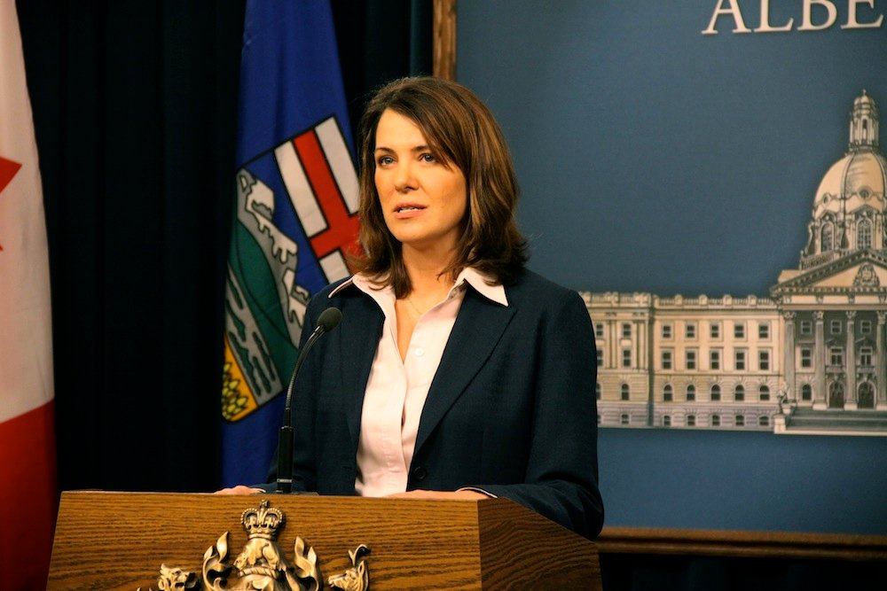

<figure>

<figcaption>

photo by[Dave Cournoyer](https://www.flickr.com/photos/daveberta/5388361516/)

</figcaption>

</figure>

…we know the voters of the Energy Province made the wrong decision in the April 24th legislative election.

Most were well aware that **Danielle Smith**, the leader of Alberta’s **Wildrose Party** and the official Opposition Leader in the provincial legislative assembly, was a libertarian, but now we have confirmation that she be might Austrian as well, as an adherent of the ‘Austrian’ school of economics.

Here are some recent tweets where she documents her love of the Hayek vs. Keynes rap videos put out by Spike TV producer John Papola and George Mason University Professor and modern Austrian Russ Roberts:

> I never get tired of watching these videos. Fear the Boom and Bust a Hayek vs. Keynes Rap Anthem [bit.ly/hMjUtN](http://t.co/qj8kUxEk "http://bit.ly/hMjUtN") (½) [#wrp](https://twitter.com/search/%2523wrp)
> 
> — Danielle Smith (@ElectDanielle) [May 21, 2012](https://twitter.com/ElectDanielle/status/204698042056708096)

Alas, the potential to elect a true Austrian came so close.

> I wish there were more than two videos! Fight of the Century Round 2 Hayek vs. Keynes rap video [bit.ly/KsZxLe](http://t.co/on8hkPCv "http://bit.ly/KsZxLe") (2/2) [#wrp](https://twitter.com/search/%2523wrp)
> 
> — Danielle Smith (@ElectDanielle) [May 21, 2012](https://twitter.com/ElectDanielle/status/204698545213800449)

Along the same theme, here is a great interview where she categorizes what it means to be libertarian in Canada and Alberta:

https://www.youtube.com/watch?v=LAHoV3OQp3M
