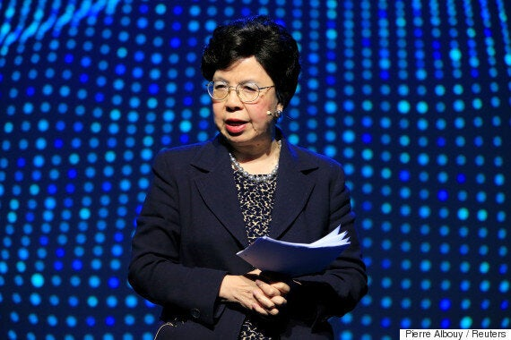
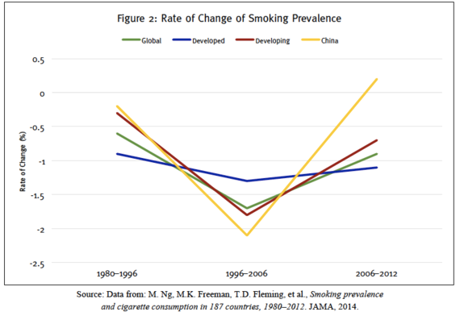

_Many countries, such as Canada, are focused on implementing the United Nations' Sustainable Development Goals and universalizing coverage. Others, pushed by the WHO, are leading anti-tobacco efforts. But many are seeking a reduced role for determining health policy at the very top level._

For the first time in recorded memory, the race to lead the World Health Organization is playing out in the unlikeliest of places: Twitter.

Equipped with infographics, [hashtags](https://twitter.com/hashtag/NextDG?src=hash) and slogans, the top candidates to become Secretary General of the world's largest public health agency have used social media to try to engage with the world community.

https://twitter.com/DrTedros/status/856745347724562432?ref\_src=twsrc%5Etfw%7Ctwcamp%5Etweetembed%7Ctwterm%5E856745347724562432%7Ctwgr%5E%7Ctwcon%5Es1\_c10&ref\_url=https%3A%2F%2Fwww.huffingtonpost.ca%2Fyael-ossowski%2Fworld-health-organization-election\_b\_16228544.html

But with growing concerns about the effectiveness of public health policy by other institutions, will the mandate of the WHO build a "better, healthier future" still ring true?

The short-listed candidates are now down to three, each with their own diverse backgrounds and visions for how public health policy should be shaped.

Tedros Adhanom Ghebreyesus, the candidate from Ethiopia, [seems intent on reforming the WHO](https://www.devex.com/news/q-a-who-candidate-tedros-adhanom-ghebreyesus-89464) to focus on deadly diseases which have taken a toll on his continent. "When reforming, we have to focus on getting things done, also, because the world expects quick results, quick wins," he said.

David Nabarro, the U.K. candidate who oversaw the WHO's ebola and flu efforts at its peak, wants a bigger emphasis on mitigating climate change. He's gotten public support from Russian health officials, [including Minister of Health Veronika Skvortsova](https://twitter.com/davidnabarro/status/854288161958133760).

The last candidate, Sania Nishtar of Pakistan, has the broadest resume as a cardiologist, reformer and [health entrepreneur](https://medium.com/@MariamMalik_/why-my-former-boss-is-the-right-pick-to-reform-the-world-health-organization-21fbbd9c7bab). She's staked her campaign on the developing world and not being too presumptuous with public health policy. "I realize that every attempt at priority setting in the past has only come up with a longer wish list," she said in an [interview](http://www.sciencemag.org/news/2017/01/meet-three-people-who-hope-lead-who-trump-era) with _Science_ magazine.

A lot is at stake in this election, including the future of global health. Many countries, such as Canada, [are focused](https://www.ec.gc.ca/dd-sd/default.asp?Lang=En&n=CD30F295-1) on implementing the United Nations' Sustainable Development Goals and universalizing coverage. Others, pushed by the WHO, are leading anti-tobacco efforts. But many are seeking a reduced role for determining health policy at the very top level.

Last month, European Commission President Jean-Claude Juncker released the much-anticipated white paper on the "Future of Europe."

Its conclusions startled some, specifically the aims of public health policies which have been at the center of EU policy in recent years.

> The fate of public health could very well be at stake.

The EU will do "less in domains where it is perceived as having more limited added value, or as being unable to deliver on promises," the commission concludes. "This includes areas such as regional development, public health, or parts of employment and social policy not directly related to the functioning of the single market."

As such, the white paper urges that "more flexibility" be left to member states to experiment in certain areas.

For many public health activists, that conclusion was alarming.

"It is extremely disappointing that public health has been used as an example of an area where the EU should consider doing less," balked the European Public Health Association in a [statement](https://eupha.org/repository/advocacy/EUPHA_Statement_Future_of_Europe_def.pdf). "We cannot understand how the white paper proposes to do less on public health, when the health is a matter that European citizens cherish dearly."

Some countries such as Italy, however, [celebrated the commission's efforts to give member states more breathing room](http://news.xinhuanet.com/english/2017-03/12/c_136121370.htm) -- something the public health establishment is leaning towards, especially once the costs are considered.

This is especially true in the realm of global tobacco policy, spearheaded by the WHO's Framework Convention on Tobacco Control.

According to a [study published in the health journal The Lancet](https://www.google.cz/url?sa=t&rct=j&q=&esrc=s&source=web&cd=1&cad=rja&uact=8&ved=0ahUKEwixnv7sy7_TAhXmdpoKHQZtAc4QFggkMAA&url=http%3A%2F%2Fthelancet.com%2Fjournals%2Flanpub%2Farticle%2FPIIS2468-2667\(17\)30045-2%2Ffulltext&usg=AFQjCNG_JrOHNai2Jae1n) last month by Canadian researchers at the University of Waterloo, global smoking rates have decreased by just 2.5 per cent in over a decade, [despite a nearly $18 million budget](http://www.fctc.org/media-and-publications/fact-sheets/1432-fctc-budget-and-workplan-cop7) of the FCTC and massive spending by national governments.

"The researchers were unable to account for how well enforced the policies were," researchers [said in the media release](https://www.eurekalert.org/pub_releases/2017-03/tl-tlp032117.php) accompanying the report. "Although progress in combatting the global tobacco epidemic has been substantial, this progress has fallen short of the pace of global tobacco control action called for by the treaty."

Not only have these efforts proved to be less than effective, it seems they haven't affected the places most plagued by smoking.

A [2016 study](https://www.google.cz/url?sa=t&rct=j&q=&esrc=s&source=web&cd=7&cad=rja&uact=8&ved=0ahUKEwiRiZ3zzb_TAhVmYpoKHQxQCi4QFghLMAY&url=http%3A%2F%2Freason.org%2Ffiles%2Fpb136_tobacco_harm_reduction.pdf&usg=AFQjCNG8HNfAwsUPbVZcDKky9qxurcTeAw) by the Reason Foundation revealed that smoking rates in developing countries have actually increased, specifically China and India. "It is fair to say that, 11 years after the FCTC came into force, it has not proven to be a stellar success on its own terms," concludes the report.

_Source: The Reason Foundation_

As to whether a policy shift for the FCTC and similar efforts would be included in reform, the top candidates for WHO's leadership have not yet released any public statements to this effect. Which could certainly precipitate a crisis for public health.

One potential reform potential for the WHO lies in be adopting measures for harm reduction, specifically vaping and e-cigarette technologies which are proving to be less harmful than tobacco smoke.

The Tobacco Harm Reduction Expert Group, [formed last year and made up of public health experts](http://www.businessmirror.com.ph/who-opposition-to-tobacco-harm-reduction-threatens-public-health/) from Greece, Italy, the United Kingdom and India, says that opposing alternative technologies is harming public health.

"The WHO has an opportunity now to improve radically the life expectancy of today's smokers by applying the principle of harm reduction that is already one of the core principles of WHO's tobacco control strategy," they said in a [statement released](https://www.google.cz/url?sa=t&rct=j&q=&esrc=s&source=web&cd=16&cad=rja&uact=8&ved=0ahUKEwim88v6z7_TAhXFKJoKHYdjACM4ChAWCD4wBQ&url=http%3A%2F%2Fwww.dsdaily.org.uk%2FPDF%2FTHR%2520Expert%2520Group%2520Press%2520Release%25207%2520November%25202016.p) in India last year.

If the candidates to lead the WHO want to embrace reform, it's clear that harm reduction will prove more effective in combating the disastrous health effects of tobacco.

The election to become the next Secretary General of the World Health Organization will be held at the next general assembly in May. The fate of public health could very well be at stake.

_This article was published in the [Huffington Post](https://www.huffingtonpost.ca/yael-ossowski/world-health-organization-election_b_16228544.html)._
