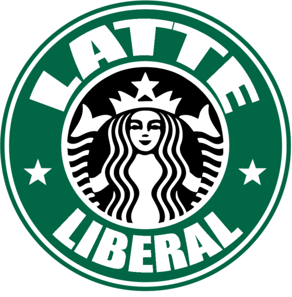

If there is one thing which seems outdated in current political systems, it is the arcane use of political labels.

One would assume these long-held classifications would be universal across different cultures, but it turns out they’re just as petty and random as the individual lines alternatively called “borders” by those who aim to control free peoples.

The most confusing term in my experience is ‘liberal.' 

No doubt, American readers see that term and it conjures very specific images.

Barack Obama. Bill Clinton. FDR. Democrats. Leftists. Socialists.

But not too long ago, someone labeled a 'liberal’ was seen very differently.

Noted economist F.A. Hayek [prided himself on being a liberal](http://hem.passagen.se/nicb/cons.htm) – someone who believes in property rights, the supremacy of the individual, and limited, representative government.

But today, that definition has been lost to different so-called “ideologies,” leaving liberal to the heirs of the progressive movement of the early 20th century.

Liberal doesn’t mean individual rights, local democracy, or limited government anymore; instead it means “generous” government, loose government with a penchant for being charitable – with other people’s money, of course.

And that notion has held true throughout the Anglo-American empire.

**Maxime Bernier**, probably the only free-thinking Canadian MP, [prefers the term “conservative”](http://www.maximebernier.com/2013/03/comment-propager-les-idees-conservatrices/) for his version of classical liberalism, especially as a big honcho for the **Conservative Party of Canada**. He’s joined by MEP **Daniel Hannan**, a member of a party with the same name in the UK.

[Hannan has an affinity for Canadian-style conservative unification](http://blogs.telegraph.co.uk/news/danielhannan/100144719/britain-has-confined-itself-in-a-cramped-and-dwindling-customs-union-but-our-sundered-kindred-thrive-overseas/), and believes it is the best way to revisit liberal values, but the parties haven’t exactly lived up to the same traditions in the last few years.

In both of these countries, for instance, the conservative parties control the governments.They inflate, deficit-spend, and trample individual rights just as much as any progressive government.

What then does conservative really mean?

Is it really a modern interpretation of liberal?

In most of Europe, mainly on the continent, they’ve stuck to the original interpretation of liberal. 

It seems self-explanatory enough. It’s the realization of the invisible hand, the government which governments least and lets people live their lives without burdensome interference.

But to that point, there are virtually no liberal parties with any significant traction or power in continental Europe – save perhaps for the **Free Democratic Party** in Germany, which is included in the ruling coalition. The jury is out on their effectiveness at controlling the growth of government, but I’ll give them the benefit of the doubt.

In the rest of mainland Europe, liberal is taken to be the market-oriented position, the one emphasizing the importance of private business in bringing wealth to the government so social programs can be funded. They’re not necessarily talking about dismantling the welfare state, but they’re at least giving some representation to the true creators of wealth.

So when it all comes down to a name, who is a liberal, and in what context?

I think I’d much rather be known for safeguarding freedoms than freely spending fiat money on unsustainable programs doomed for failure.

But that’s just me. Maybe I’m wrong. Maybe we’ve all just been given crummy dictionaries. I guess whoever has the power will decide what it all means.
