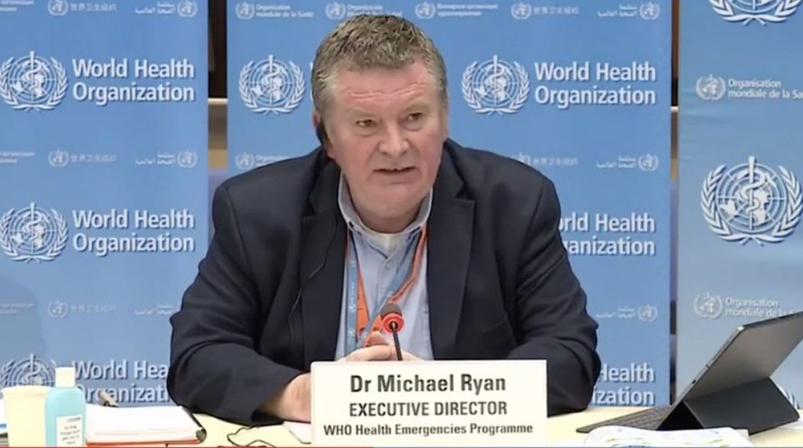

For months, an overwhelming [majority](https://www.unicef.org/press-releases/dont-let-children-be-hidden-victims-covid-19-pandemic) of the planet’s population has been subject to cruel and unnerving lockdowns: businesses closed, travel restricted, and social gatherings kept to a minimum.

The effects of the COVID-19 pandemic have sunk our economies, kept loved ones apart, derailed funerals, and made personal and economic liberty a casualty as much as our health. One report [states](https://www.marketwatch.com/story/today-in-scary-numbers-pandemic-could-cost-global-economy-82-trillion-2020-05-19) it could cost us $82 trillion globally over the next five years – roughly the same as our yearly global GDP.

Many of these initial lockdowns were justified by policy recommendations by the World Health Organization.

The WHO’s director-general Dr. Tedros Adhanom Ghebreyesus, writing in a strategy update in April, called on nations to [continue](https://www.npr.org/sections/goatsandsoda/2020/04/15/834021103/who-sets-6-conditions-for-ending-a-coronavirus-lockdown) lockdowns until the disease was under control.

But now, more than six months since lockdowns became a favored political tool of global governments, the WHO is calling for their swift end.

Dr. David Nabarro, the WHO's Special Envoy on COVID-19, [told](https://www.youtube.com/watch?v=x8oH7cBxgwE&feature=youtu.be&t=915) Spectator UK’s Andrew Neil last week that politicians have been wrong in using lockdowns as the “primary control method” to combat COVID-19.

https://www.youtube.com/embed/x8oH7cBxgwE

“Lockdowns just have one consequence that you must never ever belittle, and that is making poor people an awful lot poorer,” said Nabarro.

Dr. Michael Ryan, Director of the WHO's Health Emergencies Programme, [offered a similar sentiment](https://uk.reuters.com/article/uk-health-coronavirus-who-idUKKBN26U1ZW).

“What we want to try to avoid - and sometimes it’s unavoidable and we accept that - but what we want to try and avoid is these massive lockdowns that are so punishing to communities, to society and to everything else,” said Dr. Ryan, speaking at a briefing in Geneva. 

These are stunning statements from an organization that has been a key authority and moral voice responsible for handling the global response to the pandemic.

Cues from the WHO have underpinned each and every national and local lockdown, threatening to push 150 million people into [poverty](https://www.cnn.com/2020/10/07/economy/global-poverty-rate-coronavirus/index.html) by the end of the year.

As Nabarro stated, the vast majority of the people harmed by these lockdowns have been the worse off.

We all know people who have lost their businesses, lost work, and seen their life savings go up in smoke. That’s especially true for those who work in the service and hospitality industries, which have been decimated by lockdown policies.

And even as the WHO calls on nations to refrain from imposing lockdowns, many governments continue to use this strategy. Schools in many US states remain closed, bars and restaurants are off-limits, and large gatherings–apart from social justice protests–are condemned and shut down by force.

The effects of the prolonged lockdowns on young people are now becoming more clear. A recent [study](https://www.ed.ac.uk/news/2020/shutting-schools-increases-covid-19-deaths-study-f) from Edinburgh University says keeping schools shut down will increase the number of deaths due to COVID-19. Added to that, the study says lockdowns “prolong the epidemic, in some cases resulting in more deaths long-term.”

If we want to avoid any more harm, we should immediately end these disastrous policies. Any fresh calls to impose lockdowns should now be viewed with the utmost skepticism.

It’s time for the madness to end. Not only because the World Health Organization says so, but because our very lives depend on it.

As the doctors and scientists stated in the [Grand Barrington Declaration](https://gbdeclaration.org/) signed this month in Massachusetts, the “physical and mental health impacts of the prevailing COVID-19 policies” have themselves caused devastating effects on both short and long-term health.

We cannot continue to risk our health and well-being in the long-term by shutting in our economies and our people in the short-term. That’s the only way forward if we seek to recover from the ruinous effects of government policy surrounding COVID-19.

_This article was published on [FEE.org](https://fee.org/articles/who-reverses-course-now-advises-against-use-of-punishing-lockdowns/)._

_Republished on [Intellectual Takeout](https://www.intellectualtakeout.org/who-reverses-course--now-advises-against-use-of--punishing--lockdowns/)_.
