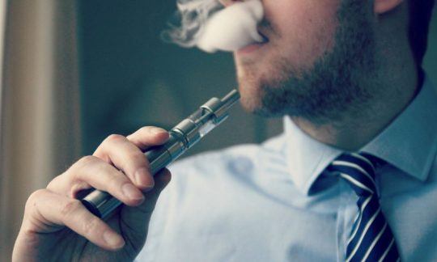

## **The war on vaping is a threat to public health**

(photo via [vaping360](http://vaping360.com/))

By Yaël Ossowski | [spiked](https://www.spiked-online.com/2018/10/12/whos-afraid-of-vaping/)

For the second time in two years, I sat in the public gallery at a United Nations conference in Geneva as a senior UN bureaucrat told us that all members of the media and public were to be barred from the proceedings. This particular occasion was one of the UN’s biannual sessions to update the World Health Organisation’s Framework Convention on Tobacco Control (FCTC).

The FCTC is the first global-health treaty enacted by WHO. It has been ratified by 181 countries and forms the basis of a number of national laws across the globe, such as tobacco taxes, advertising restrictions, and plain cigarette packaging.

Each biannual meeting is a taxpayer-financed talkfest, dominated by various health ministries and anti-tobacco organisations like the Campaign for Tobacco-Free Kids and the Framework Convention Alliance, who are not only granted ‘observer status’, but also intervene in the large plenary debates and use their platform to shame the delegates of any country which doesn’t adopt a prohibitionist attitude toward tobacco.

Though the conference claims to be about science and public health, it is anything but. For instance, new vaping and e-cigarette technologies are the most popular stop-smoking aids in England, used by 1.2million Brits according to the latest government figures. A Public Health England report says that vaping can reduce health risks by 95 per cent and can increase the chances of quitting smoking by up to 50 per cent.

But the arguments for vaping are dismissed by WHO as ‘unfounded’ and ‘inconclusive’. One top NGO said parties at the meeting should ‘refrain from engaging in lengthy and inconclusive discussion’ on alternative nicotine products like vaping.

Vaping activists had tried to attend the conference to share their stories of how they quit smoking. Volunteers from the International Network of Nicotine Consumer Organisations (INNCO) proudly blew clouds of water vapour outside the conference’s doors. Unlike the more prohibitionist NGOs, they were denied observer status.

The clear anti-vaping bias led to some absurd claims. Anne Bucher, director-general of the EU’s Health and Food Safety Directorate, was adamant that, despite containing no tobacco, vaping and e-cigarette devices should be considered ‘tobacco products’, subject to all the same laws, restrictions, and bans. The treaty itself sought to enforce the same restrictions on vaping and e-cigarettes as cigarettes and cigars. This could actually hamper people’s ability to quit smoking.

Another object of hate was the media. Delegates from countries including China, Zimbabwe, the Maldives and Uganda claimed the entire conference should take place without media or public scrutiny. ‘What we’re dealing with is the mafia’, said the delegate from Afghanistan, referring to the public sat in the gallery above.

A representative from Chad lamented that more people did not know about the FCTC meeting and its impact. In the same breath, he argued in favour of kicking out the public and media after the opening plenary.

It was a bizarre and Orwellian conference. The proposals that emerged in the name of protecting public health could seriously set back the improvements in public-health that have come about thanks to alternatives to cigarettes like vaping, e-cigarettes and snus.

One thing became clear: innovative products, new markets and the much hated ‘industry’ were doing more to bring about better health outcomes than the UN’s supranational health bureaucracy.
