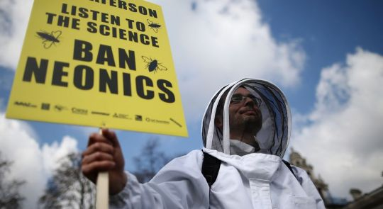

**Green NGOs are peddling dangerous junk science**  

By Yaël Ossowski | _[spiked](http://www.spiked-online.com/newsite/article/whos-really-anti-science/20068#.WWX7_NOGPHp)_  

On Earth Day this year, in London and close to 600 other cities across the world, an estimated 1.1million people took to the streets to defend the idea of science-based policymaking. Protesters called for ‘science over ideology’, the use of ‘peer-review in politics’, and more scrupulous application of evidence-based criteria for laws and legislation.

It was all in reaction to the supposedly post-truth age we find ourselves in. But it seems that message has been quickly forgotten. In the months since, campaigners and NGOs have waded into various policy debates in the UK and the European Union, advocating for solutions that have left [even UN scientists](https://sustainabledevelopment.un.org/content/documents/6619132-Goetz-Sustainable%20Biomass%20Production%20in%20the%20Context%20of%20Climate%20Change%20and%20Rising%20Demand.pdf) shaking their heads.

On the pesticide front, anti-science claims by publicly funded NGOs have [routinely tipped](https://www.euractiv.com/section/agriculture-food/news/greenpeace-neonicotinoids-pose-risks-to-multiple-species/) the UK and the EU against innovation and established research. The chemical and weed-killer glyphosate has come under fire from various NGOs for its apparent connection to carcinogens, despite [definitive statements](http://www.efsa.europa.eu/sites/default/files/170523-efsa-statement-glyphosate.pdf) from the European Food Safety Authority and 27 out of 28 member states which argue the opposite. ‘If political actors discredit scientific organisations because they don’t like the outcome in one out of 100 cases, they diminish the reputation of an organisation that they as policymakers will need to rely on in future’, [said Bernhard Url](http://uk.reuters.com/article/uk-science-europe-glyphosate-exclusive-idUKKBN17N1XD), executive director of the European Food Safety Authority.

For the UK, a law banning herbicides containing glyphosate would be disastrous. It would cost nearly £940million and cut wheat exports by 20 per cent for British farmers, according to a recent study by the [Crop Protection Association](http://www.agriland.ie/farming-news/glyphosate-ban-would-squeeze-uk-wheat-output-by-20/). Nevertheless, groups such as Greenpeace and the Environmental Defense Fund are [pulling out all the stops](https://risk-monger.com/2016/04/13/iarcs-unprofessional-and-unethical-behaviour-time-to-retract-their-glyphosate-monograph/) to ban the herbicide – without effective scientific evidence.

Then there’s issue of the [dwindling bee population](http://time.com/4688417/north-american-bee-population-extinction/). NGOs have named as the main culprit the class of pesticides which use neonicotinoids – synthesised particles based on the structure of nicotine. At the behest of Greenpeace, the European Union [passed a continent-wide ban](https://www.theguardian.com/environment/2013/apr/29/bee-harming-pesticides-banned-europe) on these pesticides back in 2013, and has [recently called](https://www.theguardian.com/environment/2017/jan/12/europe-should-expand-bee-harming-pesticide-ban-say-campaigners) for expanding that ban to more products. But this would be wrong.

A peer-reviewed study published in June in the journal _Science_ found that use of neonicotinoid pesticides actually increased the bee populations in various field experiments. The researchers were from the Natural Environment Research Council in Oxfordshire and a host of German universities. They recognised the benefit these pesticides can produce. ‘Don’t give up on neonicotinoids’, wrote [lead researcher](https://theconversation.com/our-research-showed-a-controversial-insecticide-can-harm-bees-but-it-still-has-its-uses-80490?utm_source=POLITICO.EU&utm_campaign=207e88c450-EMAIL_CAMPAIGN_2017_07_07&utm_medium=email&utm_term=0_10959edeb5-207e88c450-19) Ben Woodcock. ‘Neonicotinoids do have a vital role to play in food production… They can be used in low dosages, reducing the need for broad-spectrum insecticide sprays. They are also useful in controlling pests which have already developed some resistance to other pesticides.’

Writing in _The Times_, [Matt Ridley called the ban ‘disastrously counterproductive’](https://www.thetimes.co.uk/article/europe-s-age-of-unreason-harms-its-wildlife-jxn5dzhgv), and an action that has ‘had no benefit at all for the bees’. In fact, because these pesticides were banned, more harmful pesticides were used across the continent, which will have a more devastating impact, according to a report by the [EU’s Joint Research Centre](http://www.spiked-online.com/newsite/article/whos-really-anti-science/www.europarl.europa.eu/sides/getDoc.do?type=WQ&reference=E-2017-000696&language=EN),

And the march against science goes on. In a [report](https://www.chathamhouse.org/sites/files/chathamhouse/publications/research/2017-02-23-woody-biomass-global-climate-brack-final2.pdf) released earlier this year by Chatham House, researchers focused their ire on wood-based biomass technology, a key renewable source of energy. The report aimed to discourage public authorities from ‘locking themselves in’ with an energy source that only provides ‘short-term’ benefits. And yet biomass wood pellets, used increasingly at former coal-powered stations across the world, [offset carbon emissions](https://www.ecowatch.com/is-biomass-energy-renewable-1891131459.html) because they are derived from natural forests. By 2030, it is estimated that biomass could account for 60 per cent of global renewable-energy use, according to the [International Renewable Energy Agency](https://www.renewableenergymagazine.com/biomass/irena-biomass-could-reach-60-percent-of-20140925).

Once more, various environmental campaigners have put politics over science. The International Energy Agency [blasted the Chatham House report](http://www.ieabioenergy.com/wp-content/uploads/2017/03/Chatham_House_response_supporting-doc.pdf) for its ‘unsubstantiated claims and flawed arguments’, accusing it of giving credence to the NGOs’ arguments that biomass is not a renewable source of energy that could help the country wean off fossil fuels. Oddly enough, it was on Earth Day, 22 April, that the UK National Grid announced it was the [first day in nearly 250 years](http://www.dailymail.co.uk/news/article-4433318/Britain-set-coal-free-day-250-YEARS.html) that Britain’s energy production would be coal-free, thanks to biomass and natural gas. Even the 2015 Global Sustainable Development Report [recognised](https://sustainabledevelopment.un.org/content/documents/6619132-Goetz-Sustainable%20Biomass%20Production%20in%20the%20Context%20of%20Climate%20Change%20and%20Rising%20Demand.pdf) that biomass wood pellets will prove vital in reducing greenhouse-gas emissions and combating climate change.

The debate over whether evidence-based policymaking should be the guiding mantra for politicians seems to be moot. There’s an effective and well-funded machine of environmental lobbies and activists pushing bad science to political ends. In response to this, the London-based Campaign for Science and Engineering called [in its summer report](http://www.sciencecampaign.org.uk/resource/casereportimprovingtheuseofevidence2017.html) for more science advisers and publicly funded agencies to ensure politicians uphold the integrity of scientific research. But more than that, our public institutions should listen more to the scientists and less to the activists funded by public money.

_**Yaël Ossowski** is a Canadian journalist and deputy director of the [Consumer Choice Center](https://www.consumerchoicecenter.org/yael-ossowski/)._
