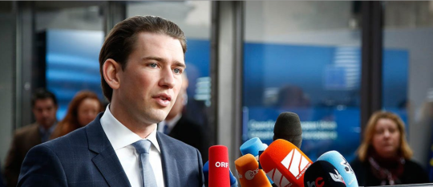

By Yaël Ossowski | [Metropole Magazine](http://www.metropole.at/why-austrias-millennial-minister-sebastian-kurz-could-be-dangerous/)

## On Saturday, July 1st, in a muted and highly uncontested leadership election in Linz, Austria, 30-year-old Sebastian Kurz secured 98.7 percent of the vote to head the [Austrian People’s Party (ÖVP)](https://en.wikipedia.org/wiki/Austrian_People%2527s_Party) before October’s elections.

A mere three days later, the headlines surrounding Kurz were far less flattering. A scandal surrounding a study on religious kindergartens was added to whispers of flirtations with the far-right [Austrian Freedom Party (FPÖ).](https://en.wikipedia.org/wiki/Freedom_Party_of_Austria)Austrian media had a field day.

Well-dressed and speaking in a posh Viennese accent, the young Minister of Foreign Affairs and Integration had unveiled his platform and strategy for earning the conservatives a majority in Parliament and their first chance at the top in nearly 10 years.

The announcement of the upcoming fall election came as a surprise to many, sparked by the May collapse of the “grand coalition” between the People’s Party and [Social Democratic Party of Austria (SPÖ)](https://en.wikipedia.org/wiki/Social_Democratic_Party_of_Austria), the ubiquitous power-sharing arrangement that has, for the most part, governed the Republic of Austria since the end of the Second World War.

Austrians have grown tired of the red-black compromise, pushing both parties to begin thinking out of the box if they wish to secure democratic legitimacy at October’s polls.

**The Social Democratic Nightmare**

Having swept away any hope at reviving the grand coalition, Kurz’s only chance to win a majority and effectively wrestle away the chancellor position from the social democrats will be to embrace the FPÖ in coalition. That may not be enough to stem the influence of the far-right across Europe, but it will be enough to pigeonhole them in Austria. Behind closed doors, all indications point to the social democrats floating the same idea.

Last time such a coalition was formed in 2000, [international sanctions and condemnations](http://uk.reuters.com/article/uk-austria-politics-alliance-idUKKBN1781QX) from the EU flooded Austria. Neighboring countries tried to cut the nation off from international summits and accords, protesting the government formed with a xenophobic party founded by ex-SS officers.

But the Freedom Party’s shaky record and broken promises have kept it away from the controls, leading to major losses in the 2002 elections. Four years later they tenuously held on to power as junior partner of the People’s Party, before being relegated once more to the oppositional benches in 2006. Ever since, the grand coalition has managed to keep the Freedom Party out of power, but many Pundits fear Kurz’s soft embrace may change that tide.

**Conservatism Catering to Xenophobia**

His stance in the midst of the migrant crisis speaks precisely to many card-carrying members of the Freedom Party, scared by the influx of foreigners into a country of only 8 million.

“The success of integration efforts depends strongly on the number of immigrants to be integrated,” he said in June. “Therefore, migration to Austria must be restricted.”

Kurz’s ascension to power was all but evident over the course of this crisis. It was made all the more immediate after the resignation of longtime party leader Reinhold Mitterlehner in May, who quite directly expressed in his final press conference that he does not intend to stay put as a placeholder while other ministers try to undermine the government. That’s when Kurz’s long-term plans could finally take root and the “New People’s Party” could emerge.

Born just three years before the fall of the Berlin Wall, Kurz is already a veteran of international politics: He has served as Foreign Minister since 2013, played host to the Iranian nuclear negotiations, and been one of the loudest voices in resolving Europe’s migrant crisis.

Appointed at just 27 years old, he easily claimed the title of youngest Foreign Minister in European history. But lest that keep his agenda short-lived, he’s managed to plot himself on the world stage through a multitude of summits and statements, from the Ukrainian crisis to the role of radical Islam in European societies.

**From Crown Price to #Kurzleaks**

It’s this fresh, bold approach that has made his perspective so desired by Austrians across the spectrum.  In December, 2016 the left-leaning Viennese weekly Falter dubbed him [“Crown Prince Kurz,”](https://www.falter.at/archiv/wp/kronprinz-kurz) calling attention to his radical approach but “princely” stature in the eyes of many Austrians. For a country that even divides its unions, clubs, and associations by party membership, this is new for Austria.

In order to march forward, he’ll be taking a page from the book of French President Emmanuel Macron’s literal En Marche movement, leading a slate of candidates under the “Sebastian Kurz List” rather than brandishing the traditional colors. The party color, once conservative black, has now been changed to a muted cyan, matching the graphics and design found on Kurz’s social media accounts for the past several years.

But Kurz’s path to power as an Austrian politician aiming for the chancellery will be unconventional: he won’t bank on the grand coalition between the conservatives and the social democrats (SPÖ) that have kept Austria together since the end of the Second World War.

Rather, he’s expected to rally the far-right FPÖ as a coalition partner, an act deemed verboten by most in the small Alpine Republic. The thrice-attempted Austrian Presidential election in 2016 worried international commentators as Freedom Party candidate Norbert Hofer came within a whisker of winning, albeit for a symbolic position without much executive authority.

Nonetheless, the attacks from Anglo-American press [were united](http://4liberty.eu/austria-leagues-beyond-its-past-so-stop-invoking-it/) in warning of the reawakening of Austria’s Nazi past, seemingly just a ballot box away. It may just take someone like Kurz moderating power to assuage those fears.

He’s had a penchant of being able to say the right thing at the right time, giving him the reputation of someone who “says it like it is” – even if others might have already brought up the idea before, albeit in more nuanced ways. When Turkey exported its presidential campaign to Turkish citizens living in the EU, and tried to host rallies and events in the Netherlands, Germany, and other countries, Kurz was chief among EU diplomats to rebuke Erdogan and cohorts. He’s been more accommodating to Russia and skeptical of increased involvement in Ukraine.

One of his favorite talking points over the last years, though, has been his vociferous opposition to kindergartens run by Islamic organizations, which are mainly prevalent in Vienna. About a year ago, a study commissioned by Kurz’ Foreign Ministry and conducted by Univeristy of Vienna professor Ednan Aslan seemed to expose a deeply troubling situation. Some Islamic kindergartens were allegedly promoting parallel societies and orthodox Islamic values at odds with those of a free society. Kurz’ criticism of the City of Vienna was sharp and unyielding.

On July 4th, however, Falter published a front page scoop titled “Kurz-Leaks”, [showing how](https://cms.falter.at/falter/2017/07/04/frisiersalon-kurz/) officials of the Foreign Ministry profoundly changed and amended the study to bring it more in line with Kurz’ political course. The debate – annotated by the hashtag #kurzleaks – is still raging on, but in a time of alternative facts, the Austrian public finds it deeply troubling that a minister and aspirational chancellor of the republic might have played fast and loose with scientific integrity and candor towards Austria’s citizens.

**Power to Prevail?**

The parchment of an Austrian chancellor, however, affords this luxury. Unlike Germany and France, Austria is not a member of NATO and is permanently affixed as a neutral nation per its constitution of 1955. The economies and populations of those countries dwarf Austria’s. Kurz’s role, if successful, will therefore be more of a conductor than a statesman with any real authority on the European stage.

If there is anyone who can tame the furthest fledges of the far right, Kurz, with his own agenda and politics, may the one to do so. Whether the people of Austria will agree come October is dependent on time and whether any unforeseen crisis pops up to upend the careful and calculated political agenda.
