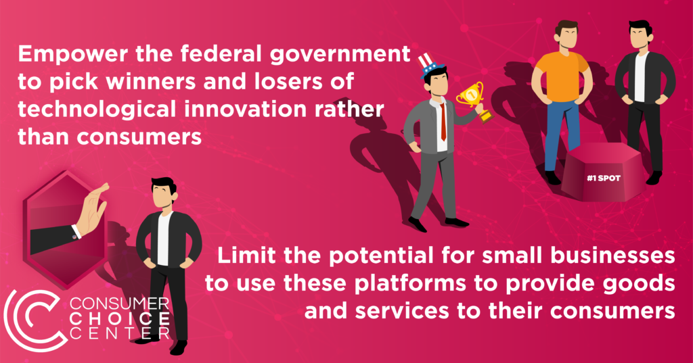
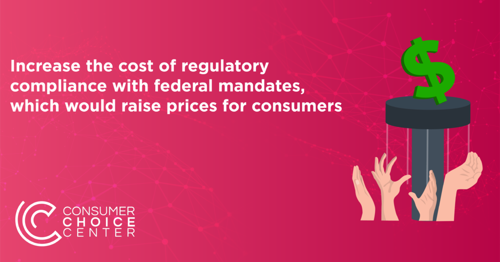
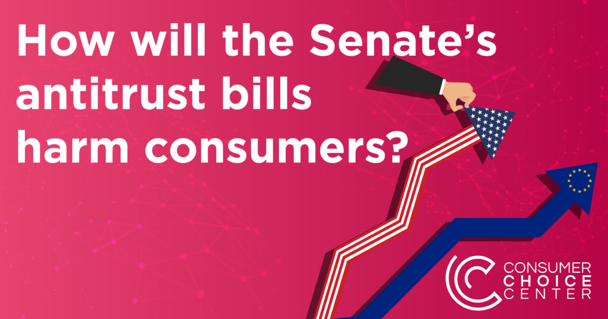

The U.S. Senate is considering two antitrust bills by Sen. Amy Klobuchar that would significantly harm both consumer choice and innovation.

Unfortunately, these bills have been co-sponsored by members of both political parties, creating what looks like a bipartisan consensus in the Senate chamber, but not one favored by the vast majority of American consumers.

Both the [American Innovation and Choice Online Act](https://www.congress.gov/bill/117th-congress/senate-bill/2992/text) and [Platform Competition and Opportunity Act](https://www.congress.gov/bill/117th-congress/senate-bill/3197/text?r=2&s=10) appear to be general antitrust regulations but are in fact targeted attacks on consumers who benefit from the services of a handful of tech companies.

While there are [plenty of reasons](https://www.washingtonexaminer.com/opinion/facebook-failures-censorship) to criticize certain tech companies and their business or moderation decisions, inviting the government to control, direct, or otherwise halt innovative goods and services from specific tech companies would create more problems for consumers than it would solve.

**Don't You Dare Sell Your Own Products**

The first bill would aim to outlaw "discriminatory conduct" by the platforms targeted, mostly concerning their own products and applications. Think of the vast array of Amazon Basics products, Google's services other than search, or even Facebook offering Messenger.

These goods and services are offered by companies because the firms have built up specialized knowledge and consumer demand exists for them. Even though these firms sell products and offer services from third parties, they also sell their own, similar to Walmart's ["Good Value" brand or even "George" clothing line](https://en.wikipedia.org/wiki/List_of_Walmart_brands).

When it comes to tech offerings, as [noted](https://t.co/bYXuz22q2v) by Adam Kovacevich of the Chamber of Progress, this would basically halt Amazon Prime, it would block Apple from pre-loading iMessage and Facetime, and require Apple and other phone makers to allow third-party apps to be "sideloaded" outside the traditional app store. Not only would this be inconvenient for consumers who like and use these products, but it would also make it harder to innovate, thus depriving consumers of better goods and services that could come down the line.

https://twitter.com/adamkovac/status/1483837922923233292

**Don't You Dare Acquire Other Companies**

The second bill more radically alters existing antitrust law by basically baring large-capitalization tech firms from acquiring or even investing in other firms. Again, this

The rise of Silicon Valley has been an unadulterated success for American consumers, owing to the entrepreneurship of startups, companies and investors who see value in them, and the unique pollination of both talent and capital that has made American technology a dominant global player.

This bill purports to ensure consumers are protected from the "evils" of Big Tech, but in reality, it would put American entrepreneurs at a significant disadvantage globally, inviting companies from illiberal countries to offer products to consumers and reducing the options and choices for anyone who enjoys technology products.

**Why Consumers Should Oppose**

Rather than protect the consumer, these bills would have serious impacts on the overall consumer experience and consumer choice: 

- They would restrict the innovative growth of US platforms while giving tech firms abroad an advantage

- They would degrade the consumer experience by reducing the options and services firms could offer 

- They would empower the federal government to pick the winners and losers of technological innovation rather than consumers

- They would limit the potential for small businesses to use these platforms to provide goods and services to their customers

- They would increase the cost of regulatory compliance with federal mandates, which would raise prices for consumers

The American people benefit from a competitive and free market for all goods, services, and networks we use online. Weaponizing our federal agencies to break up companies, especially when there is no demonstrated case of consumer harm, will chill innovation and stall our competitive edge as a country.

**If Congress wants to update antitrust for the 21st century they should:**

- Establish more clear penalties for breaches of data or consumer privacy and empower the Federal Trade Commission to act where necessary

- Punish companies that violate  existing antitrust provisions that harm consumers

- Better define the scope of the consumer welfare standard in a digital age

The internet is the ultimate playground for consumer choice. Government attempts to intervene and regulate based on political considerations will only restrict consumer choice and deprive us of what we’ve thus far enjoyed.

The overwhelming majority of users are happy with online marketplaces and with their profiles on social platforms. They’re able to connect with friends and family around the world, and share images and posts that spark conversations. Millions of small businesses, artists, and even news websites are dependent on these platforms to make their living.

Using the force of government to break apart businesses because of particular stances or actions they’ve taken, all legal under current law, is highly vindictive and will restrict the ability of ordinary people to enjoy the platforms for which we voluntarily signed up. 

We should hold these platforms accountable when they make mistakes, but not invite the federal government to determine which sites or platforms we can click on. The government’s role is not to pick winners and losers. It’s to ensure our rights to life, liberty, and pursuit of happiness, as the Declaration of Independence states.

- 
    
- 
    
- 
    
- 
    

_Published on Consumer Choice Center's [website](https://consumerchoicecenter.org/why-consumers-should-oppose-the-latest-senate-antitrust-actions/)._
