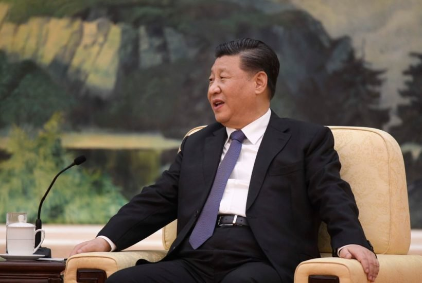

## Citizens and consumers in liberal democracies should fear the rise of the CCP

I was one of them.

One of the 147 million Americans who had their information compromised in the epic 2017 Equifax data breach. It was one of the largest hacks in history, leaking the names, social security numbers, addresses, and credit history of over a third of the country.

At first, we were led to believe it was the result of sloppy cybersecurity and greedy hackers who wanted credit card data.

But now, according to last week’s [indictment](https://www.wsj.com/articles/four-members-of-china-s-military-indicted-for-massive-equifax-breach-11581346824?adobe_mc=MCMID%3D79604551933805908873112601182153831021%7CMCORGID%3DCB68E4BA55144CAA0A4C98A5%2540AdobeOrg%7CTS%3D1581949684) from the Justice Department, we know it was the handiwork of four members of China’s military.

To think it was a few renegade black hat hackers with expensive tastes was upsetting enough, but now to learn it was the long arm of the Chinese Communist party? This is serious.

What do the Chinese communists want with my credit history? Is it to spam me with emails or offers in the mail? Or, worst-case scenario, to add me and millions of my fellow Americans to their ‘[social score](https://www.forbes.com/sites/bernardmarr/2019/01/21/chinese-social-credit-score-utopian-big-data-bliss-or-black-mirror-on-steroids/#65f5445348b8)’ database so our behaviors can be ranked and judged? 

Most of the fallout between liberal democratic nations and China in the last few years has been over governmental policy: trade spats, currency manipulation, and theft of intellectual property. These high-level issues were problematic enough, and now it seems China’s desire to exert control over the US is directly affecting the people. 

We’ve known for years that Chinese Communist Party censors have made [creeping demands](https://www.heritage.org/asia/heritage-explains/how-china-taking-control-hollywood) in Hollywood: Tibetan monks replaced with Celtic ones in Marvel’s _Doctor Strange_, Tom Cruise’s bomber jacket with the Taiwan flag removed in the _Top Gun_ sequel, and [cut scenes](https://www.nytimes.com/2019/03/26/world/asia/bohemian-rhapsody-china-censored.html) in _Bohemian Rhapsody_ to obscure that Freddie Mercury was gay.

When Quentin Tarantino [refused](https://variety.com/2019/film/news/quentin-tarantino-once-upon-a-time-in-hollywood-china-1203375792/) to edit his latest movie, _Once Upon a Time…in Hollywood_, to please Chinese censors, they pulled its release date. It was eventually [shipped](https://www.hollywoodreporter.com/news/box-office-once-a-time-hollywood-lands-china-release-date-1242408) to Chinese cinemas, but it’s uncertain if portions of the film were cut.

China has the world’s second-largest movie market, making it no surprise that with Chinese [capital](https://www.thewrap.com/hollywood-companies-owned-by-china/) comes more aggressive demands for censorship. Will they allow any criticism of Chinese communism, or even praise of liberal democracies? What about a potential movie about the brave Hong Kong protesters fighting for their liberties?

Mike Pompeo [recently](https://www.politico.com/news/2020/02/08/mike-pompeo-governors-china-112539) warned American governors to be wary of any dealings with institutions or businesses with significant ties to China. 

‘They’ve labeled each of you friendly, hardline or ambiguous,’ he said. ‘And, in fact, whether you are viewed by the Communist party of China as friendly or hardline, know that it’s working you, know that it’s working the team around you.’

These revelations about the insidious nature of the Chinese government come at a critical time. 

The Hong Kong protests continue after months of mounting force from police. Fears of the spread of the Coronavirus have emboldened Chinese authorities to fully exercise their [authoritarianism](https://www.washingtonpost.com/world/2020/01/27/chinas-coronavirus-lockdown-brought-you-by-authoritarianism/): canceling the Chinese New Year, a complete lockdown of Wuhan, a city of 11 million people, and arrests of doctors and health workers who shared their concerns about the virus on social media.

The Chinese people, at least, are beginning to wake up to the antics of their government. Li Wenliang, a doctor who was threatened by police for ‘fear mongering’ about the Coronavirus, which later [took his life](https://www.cnn.com/2020/02/06/asia/li-wenliang-coronavirus-whistleblower-doctor-dies-intl/index.html), was labeled a [hero](https://www.csmonitor.com/World/Asia-Pacific/2020/0207/Chinese-hero-doctor-dies-unleashing-public-fury-at-Beijing) for his efforts to spread the truth about the disease. But it will take many more acts of courage to cause a total paradigm shift in the minds of the people.

From the theft of credit information to entertainment censorship and brutal authoritarian crackdowns, it’s clear that citizens and consumers in liberal democracies have something to fear in the rise of the Chinese Communist party. 

For our part, we must continue to champion our free societies as bulwarks against the authoritarian regime. We must fight for the ideas and principles that have helped make liberal democratic countries great stewards of our liberties.

_[Yaël Ossowski](http://twitter.com/yaeloss) is a writer, deputy director of the Consumer Choice Center, and a director at 21Democracy._

_This article was originally published in [Spectator USA](https://spectator.us/chinese-communist-party-credit-history-equifax/)_.
