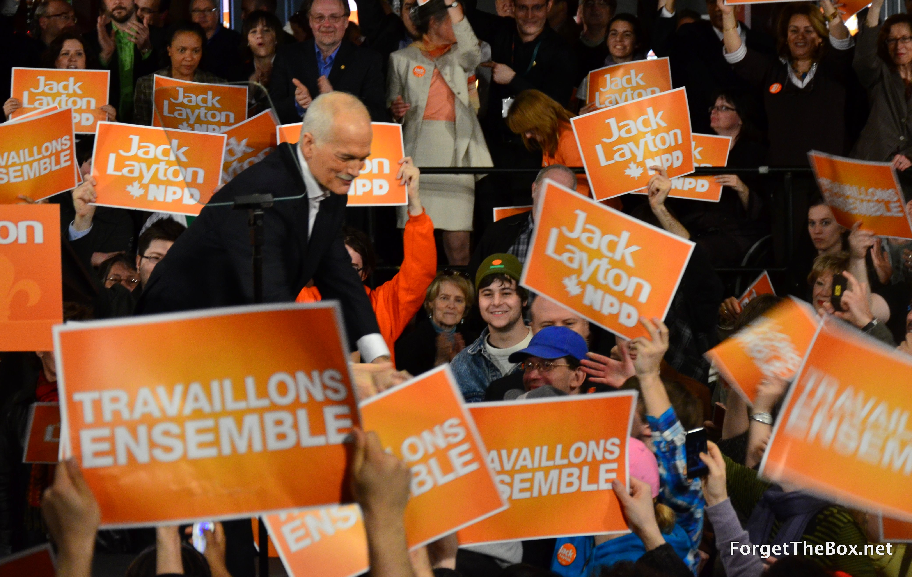

During the first stage of political consciousness, it is always relatively easy to fall into a “hope trap”—-believing that one single party or candidate will fulfill all ambitions of hope and all malaise of the past will be eradicated in favor of a new order once power is reclaimed.

Once reality kicks in, however, that appetite starkly changes. The entire record of political actions, bargains, sacrifices, and fabrications come to light and political apathy becomes the ruling mantra. This is true of any and all who have scourged through ideological and political debates, forever searching for the public officials who shall hold true to that message.

In the Canadian federal election of 2011, there is small chance that such a leader or party exists. To be clear, the ideas and parties brought before the Canadian people on the ballot box on May 2nd represent exactly the same ideas of the past 50 years, with little deviations. There are no significant paradigm shifts as far as governmental power is concerned, with all parties committed to vastly expanding the power and purse of the Federal government at the expense of all. All parties are relatively on message with the establishment, avoiding any true reforms which would make Canada a truly great, free, and prosperous country.

Seeing as a political choice must be made, however, I find it fitting to through my support behind one party and one leader. That party is the **New Democratic Party** and that leader is **Jack Layton**. To be frank, it must be said that the NDP’s platform is rather egregious. Economically speaking, the carbon taxes and general increase in governmental taxing power is enough to make any independently-minded consumer curse in his sleep. I have no doubt that the economic reforms proposed by any NDP government will surely hinder the chance of growth and prosperity in Canada for years to come. The flawed economic visions of state expenditure to “boost” medical funds and “reinvent” Canada’s infrastructure represent nothing more than mass transfers of wealth on behalf of an already-strained Canadian public. The “feel-good” imposition of new taxes aimed at emitters of Carbon Dioxide will leave industry crippled and the energy costs of the average Canadian increased threefold. The increased centralization and attempted economic planning will leave an entire market wary of Canadian investment and the Canadian future, leading to evermore insecurity and instability peddled by the government. As bad as all of these policies would be if implemented, I believe that there are a few issues which trump any tax plan proposed by the NDP; issues which should unite all Canadians regardless of idealogical or party affiliation. I speak of course, of the Canadian nation as a peaceful state.

In publicly endorsing the NDP, I realize that I find myself aligned with sectors of the population which I find rather abhorrent, if truth be told. These are the same individuals which routinely label Prime Minister Harper a “facist” or “right-wing ideologue”, an “evil” man with an “extreme” agenda who wants to “exterminate” gays and “take away” all rights for women. These are the same individuals who know relatively little of foreign affairs or economics, and claim that we must “bring carbon emissions to zero”, or that we must “tax the rich to death” and constantly increase welfare budgets at the expensive of all others.

By placing my hand upon the lever of the NDP, I succumb to the same ideological forces I have battled my entire life, from the halls of academia to the streets of Europe. This is an action I do out of principle, love, and respect for a Canada that I wish to live in, a Canada that I wish to be a proud citizen of.

In offering my reasoning, attention should be paid to what separates the NDP from all other federal parties. Though it is the social-democratic party in this election, it is also the party that is _most stringently against Canadian intervention in foreign countries_. In the present case, this is both Canada and Libya. Owing to Canada’s proximity and relationship to the United States, it is no secret that Canada has served as an extension of the ambitions of the American empire. The guarantee of Canadian troops in Afghanistan, as well as the brief flirting with troops in Iraq, clearly demonstrates the level to which Canadian foreign policy has been exported to the neighbor to the South. Canada’s role in Libya is as unclear as the mission itself, where the only clear goal seems to be that of Western control of oil towns in the North. In the debates as well as the official NDP platform, Jack Layton makes it clear that the role of Canada’s military is to protect Canada, not investments of private corporations around the world. This is a view he has expressed over the years, and I believe that his message outshines that of either Harper or Ignatieff, who both make the case that Canada should stay involved in these entangling occupations.

I believe the issue of war to be so essential and so critical for the state of Canada that I am willing to disregard all the ambitious economic changes that Jack Layton and his team wish to bring to parliament. As a citizen of a free country, I can no longer allow millions of dollars and thousands of lives to be thrown to the wayside while the political leaders in Ottawa dither over census forms and gun registries. I can no longer lend my support to political parties who unquestioningly send brave Canadian soldiers to fight the wars of Americans or Europeans. I can no longer be passive while millions of individuals in other countries see men with guns and Canadian flags knocking down doors and killing innocent people based upon false premises. This is the same issue which strengthened the Québec sovereignty movement over 70 years ago, as the federal government sent French-Canadian soldiers to die in a war for His Majesty the King of England, and I have no doubt that it shall also strengthen the anti-war movement that has always separated Canada from the United States. By thrusting my support to the NDP, who have committed to a complete withdrawal from Afghanistan, I do so with a clear conscience and regard for my fellow countrymen. The idea that my money shall continue to fund an immoral operation without specific sanction or target is enough to allow to forgive the NDP on its  many faults. Pleasing international allies has never been the highest regard for the Canadian pastry maker living in Burnaby, British Columbia, or the logger living in Northern Ontario, and I’ll be damned if their sons be sent to be killed to fulfill that endeavor. The state of war has always been beyond Canada, and I believe that by shifting their allegiance to the NDP, Canadians across the country shall realize that dream and elect a government committed to peaceful world interaction, not militaristic and hierarchical killing abroad so bureaucrats in the offices of the Pentagon and Lockheed Martin can sleep easily.

In the age of globalization and world centralization, the NDP is the one party which has been most skeptical of Free-Trade Agreements and world institutions which have led to millions of lost jobs in Canada alone. Jack Layton has been committed to [preserving Canada’s sovereignty](http://www.youtube.com/watch?v=xqQIPBcbLdo) through opposition of unilateral trade agreements, enacted by both the Conservative and Liberal governments of the past few years. Layton [makes it clear](http://www.youtube.com/watch?v=rmem49ohsY8) that the push for globalized policies, often tailored and authored by large multi-national corporations, has led to decreased democracy and economic inequality, shifting Canadian resources to private hands without negotiation. This will continue to be an important issue as entities such as the World Bank and the International Monetary Fund become more active in global economic affairs, threatening the fiscal and democratic future of a competitive Canada.

If Stephen Harper is to win a majority of the seats in Parliament, that means that he will have been elected Prime Minister of Canada for a period of 5 years, with a chance of that extending to over 9 years if the majority is strong enough. While I am in agreement with some of the Conservatives’ policies, I also believe in the limiting of any concentrated power. Allowing the Conservatives to continue to rule Canada will only strengthen their grip on the Federal reigns, necessarily yielding an increase in central power that will further diminish the role of provinces and individuals. The model of parliamentary democracies is to assure that the voice of the people is to be forever heard, beyond any existing power structure. It is my belief that the Conservative hold on power has been too long in coming, and the effects of a Harper majority will be detrimental to any real progress or change for the state of Canada. That is why I shall advocate for a vote to the NDP, who have long been locked-out of the traditional ruling structure in Ottawa for too many years now. Once again submitting power to the Conservative or Liberal parties will only yield the same amount of power abuse, warmongering, and stagnant governmental reform, and I believe the Canadian people deserve more.

As the major newspapers and magazines have declared—from [the National Post](http://fullcomment.nationalpost.com/2011/04/28/editorial-board-election-endorsement-conservatives-a-clear-choice-in-uncertain-times/) to [the Globe and Mail](http://www.theglobeandmail.com/news/opinions/editorials/the-globes-election-endorsement-facing-up-to-our-challenges/article2001610/) and [the Economist](http://www.economist.com/node/18620912?story_id=18620912&fsrc=scn/fb/wl/ar/stepehnharper)—the Conservative party of Canada and Stephen Harper are the safe choices for the establishment. These entities, forever scared of any true political revolution, seek to harmonize political tensions and to carry on the same tune that has been sung for decades. These conservative (as in stagnant) organizations profit immensely from the predictable Harper regime, and they would hate nothing more than to see that stability be careened off-course by a NDP win on election day.

Yet mentioned in my reasoning for choosing the NDP is the importance of Québec in the entire equation. As I have only been a resident of the province of Québec, it is clear that my heart and mind doth beat for my own home province. As my sympathies do lie with the idea of an independent Québec state, it is forever difficult in choosing a party that shall represent the interests of the province as long as it is a partner in the most de-centralized federation in the world. Barring any impromptu referendum, the current political reality begets three nationwide parties and one regional party which vows to fight for Québec at all costs, le Bloc Québécois. Though I am partial to the concerns of the bloc, it has long been a boon for any true advancement of the sovereignty question. As long as the BQ continues to participate in the decision-making of the federal government, it cannot be an effective bargaining chip for any true independence. Its own legitimation, it seems, comes at the expense of a sovereign Québec.

In recent years, it seems that the BQ has continued to weave its strings together with the Parti Québécois, now the official opposition in the National Assembly in Québec City. Owing to that partnership, the ideological concerns of both parties have sprung from an independent, free Québec to an independent, free Québec under the dictates of European social democracy—and only for the majority French population. The drive to have Bill 101 (legally forcing all business activity to be done in French) enforced for any and all persons inside Québec represents perfectly the cavalier attitude that the BQ and the PQ unapologetically carry in order to create their own “managed” utopia. Forgoing individual freedoms and free choice, both of these parties have taken to legislating against what language people can conduct business in, and so advocate for such in all cases. The Bloc and Duceppe are the first to have taxes jacked up to the highest of levels, and the most active proponents of carbon and cap and trade schemes which will further impoverish les pauvres québécois de la belle province, _the most highly-taxed and indebted political entity in North America_. This, as well as their complete disregard for the protection of linguistic minorities within the borders of Québec, is one reason why I do not believe in voting for the BQ. It is only my hope that other proud québécois shall heed these words on this day.

In discounting the Liberals, I need only point to [an earlier post](http://libertyinexile.com/2011/02/13/michael-ignatieff-hope-for-canada/) on this very site. Then, as now, the words remain the same:

> Having read a few of Ignatieff’s books and academic articles, I can unequivocally state that he is not the Prime Minister that Canada needs in this day and age. He has shown his support for massively expanding the power and purse of the Federal Central government, for indefinitely detaining “suspected” terrorists and accused wrongdoers, using the Canadian military to intervene in other countries, expanding the tax base, and much more.

The Liberals, openly called the “natural governing party” of Canada, have been in power more times than any Canadian need be reminded, and their platform basically states the same. The Liberals will change nothing about foreign policy, expect perhaps what type of jets the Canadian military will buy to bomb innocents in Afghanistan, and will only seek to further expand taxes that Canadians cannot afford. This is not a seat change that Canadians deserve in the situation awarded to us today.

In closing, it should be restated that this endorsement of the NDP is not an appeal to that first stage of political consciousness, where all matters of political reality are tossed aside. This is an endorsement of the NDP solely because of their position on Canada’s interventions in foreign occupations, opposition to globally-sanctioned Free-Trade agreements, and their remarkably new grasp on federal power. It is to say, as much as of a cliché as it might be, that the NDP is truly the lesser of all evils. It is less evil than the power-hungry Conservative and Liberal parties as well as the equally demonic Bloc Québécois—and therefore will be my choice on this election day in Canada, 2011.

For those who shall make the decision on this day, I leave you with the words of a great visionary, Malcolm X:

<iframe class="youtube-player" src="https://www.youtube.com/embed/JZ54bKRE0ig?version=3&amp;rel=1&amp;fs=1&amp;autohide=2&amp;showsearch=0&amp;showinfo=1&amp;iv_load_policy=1&amp;wmode=transparent" width="540" height="304" allowfullscreen="allowfullscreen" data-mce-fragment="1"></iframe>

> You’re in a position to determine who will go to the White House and who will stay in the dog house. You’re the one who has that power. You can keep Johnson in Washington D.C., or you can send him back to his Texas cotton patch. You’re the one who sent Kennedy to Washington. You’re the one who put the present Democratic Administration in Washington D.C. The whites were evenly divided. It was the fact that you threw 80 percent of your votes behind the Democrats that put the Democrats in the White House.
> 
> When you see this, you can see that the Negro vote is the key factor. And despite the fact that you are in a position to – to be the determining factor, what do you get out of it? The Democrats have been in Washington D.C. only because of the Negro vote. They’ve beenjdown there four years, and they’re – all other legislation they wanted to bring up they brought it up and gotten it out of the way, and now they bring up you. And now, they bring up you. You put them first, and they put you last, ’cause you’re a chump, a political chump.
> 
> In Washington D.C., in the House of Representatives, there are 257 who are Democrats; only 177 are Republican. In the Senate there are 67 Democrats; only 33 are Republicans. The Party that you backed controls two-thirds of the House of Representatives and the Senate, and still they can’t keep their promise to you, ’cause you’re a chump. Anytime you throw your weight behind a political party that controls two-thirds of the government, and that Party can’t keep the promise that it made to you during election time, and you’re dumb enough to walk around continuing to identify yourself with that Party, you’re not only a chump, but you’re a traitor to your race!
