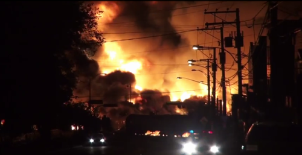
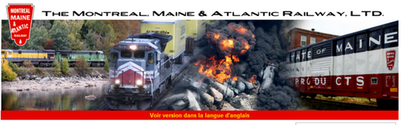

For any run-of-the-mill business based in rural America, mastering the art of a foreign language is seldom present on the all-important list of corporate goals and long-term strategies to guarantee success.

But if the events of **Lac-Mégantic, Québec** are any indication, companies should be prepared to go above and beyond in accounting for any cultural or linguistic barriers which may exist–or risk losing credibility when they may need it most.  

In this tragic case which occurred on 6 July, a train carrying 72 full tanks of crude oil violently derails in a small rural town in Eastern Québec, causing a [gigantic explosion](http://www.ledevoir.com/societe/medias/382480/le-monde-entier-a-les-yeux-tournes-vers-lac-megantic) with uncontrollable flames which haunt the town’s 6,000 residents for hours and leave an entire province in mourning.

At last count, 13 individuals lost their lives in the explosion and ensuing flames, but over 40 still remain missing, making it one of the worst tragedies in Canada’s history.

With the outpouring of support from across Canada, the United States, and the rest of the world, attention has turned to the exact cause of the derailment, with most of the ire pointed toward the company owning the train, [**Montreal, Maine and Atlantic Railway**](http://www.mmarail.com/).  

As an American railroad company based in Maine, one could hardly expect such a business to employ translators and language professionals—unless a large portion of train tracks pass through a province made up of 8 million French speakers.

Thus begins the linguistic nightmare of the Montreal, Maine and Atlantic Railway company.

Apart from the tragedy itself, which the company has been extremely negligent in reacting or even responding to, many Québécois have reserved outrage for the poor quality of the French-language press releases offered to the public.

After a rudimentary scan of the [communiqué](http://www.scribd.com/doc/152339327/MMA-7-7-2013-Press-Release-French-pdf), even a non-native French speaker can spot the obvious grammatical, punctuation, and gender errors which riddle the statement, sometimes leaving the reader confused as to what exactly the company is hoping to convey.

Worst than that, however, further research by bloggers revealed the press release was merely a [machine-translated copy](http://papitibi.wordpress.com/2013/07/08/lac-megantic-les-raisins-de-la-colere-pleuvent-sur-la-montreal-maine-atlantic-railway/) of the official [English statement](http://www.mmarail.com/sections/news/files/MMA_7.6.2013_Press.Release.pdf), meaning that it was never revised by a French translator or even French speaker.

Predictably, the poor quality communication received immediate condemnation from [commentators](http://fr-ca.actualites.yahoo.com/blogues/la-chronique-de-martine-turenne/mma---lost-in-translation%E2%80%A6-et-en-consid%C3%A9ration-172413315.html), journalists, and officials from [across the province](http://www.orandia.com/forum/index.php?id=82356), calling the machine-translated version of the press release “offensive”, “disrespectful”, and the “[worst press release of all time](http://www.lapresse.ca/le-soleil/actualites/transports/201307/08/01-4668770-drame-a-lac-megantic-le-communique-mal-traduit-de-mma-fait-jaser.php?utm_categorieinterne=trafficdrivers&utm_contenuinterne=cyberpresse_lire_aussi_4668588_article_POS3).”

This even inspired more tech-savvy critics of the company to [hack their website](http://papitibi.wordpress.com/2013/07/08/lac-megantic-les-raisins-de-la-colere-pleuvent-sur-la-montreal-maine-atlantic-railway/mma-site-bidon/), ridiculing their French and replacing the banner with pictures of the fiery tanker cars overturned and burning in the town of Lac-Mégantic.

Since that time, the company has completely taken down its French-language version of its website, replacing it with an indication that a new version is in the works.

It is only recently that a French-speaking representative of the company has presented himself to Québec’s media, and it is certain he will receive a lot of heat from residents and citizens alike who want to find out what happened in this rural town not too far from the Maine border. The investigations will reveal more about the true cause and blame.

For the purpose of linguistic and cultural analysis, however, it is important to recognize the disastrous position of the company involved. 

Rather than rely on professional translators and transcultural communicators to give an accurate and genuine statement, **Montreal, Maine and Atlantic Railway** decided to take the shortcut of passing their press release through Google Translate or a similar program.

The fervent reaction proved the act culturally insensitive and proved fault on the company itself, which did not take the proper steps to seek advice and counsel from individuals who could better adjust and craft the message in order to reassure the French-speaking population affected by this disaster.

This is an example of a cultural and linguistic _faux pas_ which may seem rare to common eyes, but is all too prominent in the milieu of professional business deals, academic forums, and majority-minority language negotiations in governmental affairs. 

As I have often learned from [**Melanie Pfeffer**](http://melaniepfeffer.com), herself a transcultural communicator and translator of German, English, and Italian, one can never assume that cultures and languages will share the same values, understand the same concepts, and tolerate the same social practices.

The standard press releases from a New England railroad firm may do wonders in Maine, Vermont, or Connecticut, but it will surely meet resistance from the French-speaking majority in Québec. That is why the world needs translators.

It is, in the case and many others, the job of the translator and the transcultural communicators to facilitate interactions between groups which otherwise would be at an impasse—proving harmful not just financially but also costly in terms of human lives.
