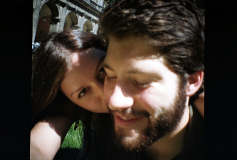

Considering my free time and my new found allegiance to autonomous servers and websites, I have created my own travel website while I am on the European continent.

Appropriately, I have titled my site **[Leben un Lieben in Wien](http://vienna.yael.es)**, or _[Living and Loving in Vienna](http://vienna.yael.es)_.

> The site is hosted through **World Outline** program and the **OPML server** mastered by podcasting pioneer [Dave Winer](http://davewiner.com), who has also inspired my [News River website](http://news.freeyael.com) and my [Radio2 Linkblog site](http://linkblog.freeyael.com).

I will be looking to these programs and functions in building my website and social networks in the next few months, especially as a method of contributing to the decentralized Internet and the broader community of [Frontier](http://en.wikipedia.org/wiki/UserLand_Software) users.

My Vienna travel site is my first attempt to build a complete site out of codes, nodes, and roots.

_**Amusez-vous!**_
