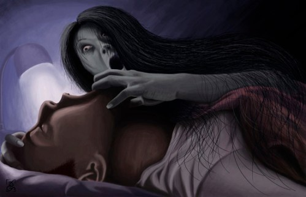
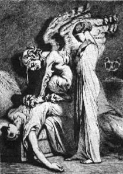

Quite fitting that upon my arrival in North America, after five months of absence, my unfortunate condition of sleep paralysis returns.

For those who have been lucky enough to stave off its misfortune, I shall explain it quite simply through my own experiences.

Sleep paralysis is a condition which plagues those who have suffered recent bouts of insomnia, environmental change, or general-level stress.

Imagine going to sleep, ever-slowly. Your body drifts off to the wonders of the dream world, sure to encounter worlds beyond thought and imagination. Your body relaxes. It remains locked in motionless, aided by REM atonia–which paralyzes the body by sending neurotransmitters to all cells in the body. Once the body is paralyzed, the mind continues in a state of consciousness.

Sleep paralysis occurs when your conscious mind drifts from sleep to being awake, even though the body cannot move in any sense. The presence of the neurotransmitters clashes with the now-conscious mind, causing hallucinations and mental fabrications. The shadows around you close in, the sounds of distant screams raise exponentially in your ear. You are in a state of helplessness, unable to move and a slave in your own body.

This state, called hypnagogia, normally invites lucid dreaming and out-of-body experiences, perhaps even the origin of the “abductor alien” stories which seem so popular amongst the X-files crowd.

The only way to revitalize your body and break free from the spell of sleep paralysis proves to be a most mental exercise. The mind must work to overcome the neurotransmitters which have been deposed to paralyze the body, the greatest example of mind control once can fathom in this life. If the mind can conquer those neurotransmitters, then the spell can be broken. For me, I am only able to achieve such one out of 4 times, leaving my body to the perils of being caught between the sleep and dream worlds without significant protection.

I explain my experience in order to gain understanding, and hopefully to provide clarity to others who may suffer from the same condition.

Here are some pictures and paintings that also quite abstractly represent the experience.

 
