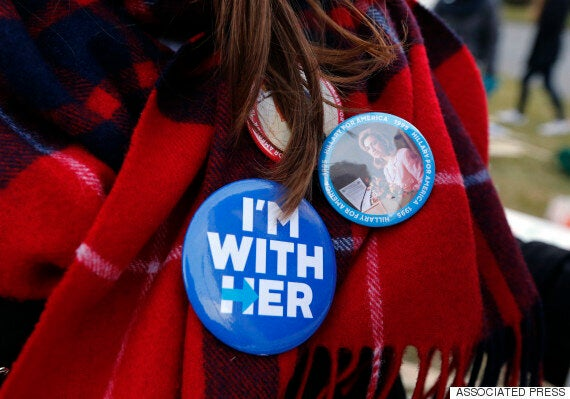

_While the burn of politics and sport may continue to persist, let every individual know that they remain free to create society as they know best. And to achieve that with their own passions for the ideas they hold dear. We don't need a president for that._

As an individual who has primarily made a career as both a journalist and an advocate for a philosophy, I'm well acquainted with ideas and their impact. I bank on it.

Ideas have always been much more powerful for than holders of ideas. Especially politicians like Hillary Clinton or now president-elect Donald Trump.

I've come to this conclusion after a long-term study of a particular philosophical framework which favours the individual over any collective.

As such, popular elections are a contentious time. Between election cycles, I spend most of my waking day thinking about how to advance a particular brand of ideas, frame news events to a popular audience, and empower young people to use their own creativity to advocate for individual and economic freedoms in their own cultures. That's my day job.

For election time, the rest of society comes to play the game. The role of government is put up for public debate and individuals who couldn't have cared less about this law or that become fervent devotees of political candidates who temporarily champion ideas.

> The role of government is not to solve every dispute in society.

The "us versus them" mentality easily takes hold, and the sides are divided. It's as true in European countries as it is in Canada and the United States.

But unlike parliamentary democracies in Western Europe, the American constitutional republic has held steadfast to a way of being: individuals do not merely vote for a candidate or party with certain ideas, but project their entire worldviews onto them. And this is a mistake.

The role of government is not to solve every dispute in society, reflect the diversity of its people or even to advocate on behalf of a particular worldview apart from that of freedom.

It is, as most all founding documents claim, to protect the life and liberty of its citizens. To ensure domestic tranquility and to protect against the infringement of certain liberties so that citizens may be allowed to flourish and live their lives as they see fit.

And that's how we ensure equality and guarantee progress. Each individual should be equal before the state, and should never fear discrimination or repression.

That's why opposing police violence against citizens is just, as well as opposing foreign intervention and war, not to mention discriminatory policies such as the drug war which disproportionally impacts minorities and make black lives matter less.

But with technology connecting us to the world in an instant, no matter how distant, we as individuals have come to expect that from our governments.

We want it to reflect our every thought and belief. Whether it comes to legislating morality for Republicans or believing individuals deserve to be coddled and protected for Democrats.

Perhaps modern nation-states aren't the best way to order human beings and ensure their collective security. I don't presume to know the next best thing, nor anyone else.

But despite that, one's government should not be how one defines themselves.

> We should know that the division between state and society exists on purpose.

I am no more Canadian because of Trudeau as I am a francophone from Quebec. Or one who likes singing Elvis or _Les Miserables_.

We should be defined by our poets, authors, musicians, philosophers and our merchants, not our politicians and public service workers. That's not how our society functions. We should know that the division between state and society exists on purpose.

In every country I've ever visited, across Europe, Asia and beyond, individuals are always skeptical of government and always question its impact on their life. And that's healthy.

In the new age of Trump, which some bemoan as others cheer, we should know that society is no stronger than it is weaker. No culture has suffered a loss or been rejected.

The greatest casualty of the election should be the two-party system, which entrenches people into finite camps in order to analyze how to solve complex issues and create a mutually agreeable order live to under.

"It is the condition of the formation of this abstract order that we leave the concrete and particular details to the separate individuals and bind them only by general and abstract rules," wrote Austrian economist F.A. Hayek in his essay, _Kinds of Order in Society_:

> "If we do not provide this condition but restrict the capacity of the individuals to adjust themselves to the particular circumstances known only to them, we destroy the forces making for a spontaneous overall order and are forced to replace them by deliberate arrangement which, though it gives us greater control over detail, restricts the range over which we can hope to achieve a coherent order."

And so while the burn of politics and sport may continue to persist, let every individual know that they remain free to create society as they know best. And to achieve that with their own passions for the ideas they hold dear. We don't need a president for that.

_This article was published in [Huffington Post](https://www.huffingtonpost.ca/yael-ossowski/progress-after-trump-election_b_12892200.html)._
